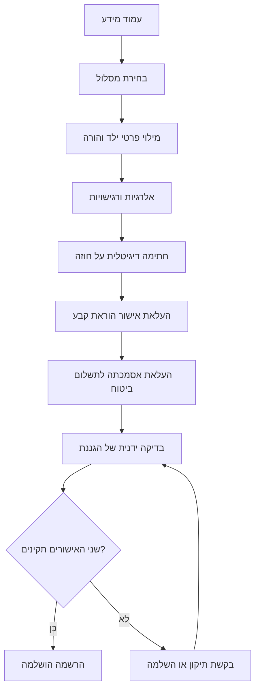

# מסמך דרישות לפיתוח – הצהרון של אביב

## פרטי המערכת

- **שם המערכת:** הצהרון של אביב.
- **שפת המערכת:** עברית.
- כל מסכי המערכת, הטפסים, הכפתורים, ההודעות, הסטטוסים והמסמכים שיופקו על ידי המערכת יוצגו בעברית.
- ממשק המשתמש יתמוך באופן מלא בכיוון כתיבה מימין לשמאל (RTL), הן באזור ההורים והן באזור הניהול.

## 1. מטרת המערכת

פיתוח אפליקציה בשם **"הצהרון של אביב"** לניהול תהליך ההרשמה והמעקב השנתי בצהרון פרטי. המערכת תחליף את התהליך הידני המתבצע כיום בעיקר באמצעות WhatsApp, ותרכז במקום אחד את המידע להורים, בחירת המסלול, פרטי הילדים, החוזים, המסמכים וסטטוס ההרשמה.

האפליקציה תפותח בעברית ותשתמש בפריסת RTL מלאה.

## 2. תחום המערכת

המערכת תכלול שני אזורים עיקריים:

1. **אזור ציבורי להורים** – צפייה במידע, בחירת מסלול וביצוע תהליך ההרשמה.
2. **אזור ניהול לגננת** – ניהול שנות לימודים, תוכן, מסלולים, ילדים, הרשמות, מסמכים ואישורים ידניים.

## 3. סוגי משתמשים והרשאות

### 3.1 הורה

ההורה יוכל:

- לפתוח קישור לאפליקציה, שאותו ניתן לשלוח אליו ב-WhatsApp.
- לצפות בעמוד המידע של שנת הלימודים הפעילה.
- לצפות במסלולים הזמינים ולבחור מסלול.
- למלא את פרטי הילד ואת הפרטים הנדרשים להרשמה.
- לדווח על אלרגיות או רגישויות של הילד.
- לצפות בחוזה ולחתום עליו דיגיטלית בתוך האפליקציה.
- להעלות אישור על הקמת הוראת קבע.
- להעלות אסמכתה לתשלום הביטוח השנתי.
- להוריד עותק של החוזה החתום.
- לצפות בתוך האפליקציה בסטטוס ההרשמה של הילד.

### 3.2 גננת / מנהלת הצהרון

בשלב הראשון יהיה משתמש ניהול יחיד: **אביב**.

הגננת תוכל:

- להיכנס לאזור ניהול מוגן.
- ליצור ולנהל שנות לימודים.
- לערוך את עמוד המידע של כל שנת לימודים.
- לנהל מסלולים, מחירים, ימים ושעות.
- לנהל חוזה נפרד לכל שנת לימודים.
- לצפות בילדים ובהרשמות ולסנן אותם.
- לעקוב אחר סטטוס ההרשמה של כל ילד.
- לבדוק ולאשר ידנית הוראות קבע.
- לבדוק ולאשר ידנית את תשלום הביטוח השנתי.
- לצפות בחוזים ובאסמכתאות.
- להסיר ילד משנת לימודים ולהחזיר אותו לפעילות.

## 4. עמוד המידע הציבורי

עמוד המידע יהיה חלק מובנה מהאפליקציה ויוצג לפני תחילת ההרשמה.

העמוד יציג את המידע של שנת הלימודים הפעילה:

- מידע כללי על הצהרון.
- סוגי המסלולים הזמינים.
- ימים ושעות הפעילות של כל מסלול.
- מחיר ותנאי תשלום של כל מסלול.
- נהלים.
- הנחיות להורים.
- תנאי ביטול או שינוי, אם יוגדרו בתוך הטקסט החופשי.
- הסבר על שלבי ההרשמה והמסמכים הנדרשים.
- סכום הביטוח השנתי.

לכל מסלול יהיה כפתור כגון **"בחירה והתחלת הרשמה"**. טופס ההרשמה ייפתח רק לאחר בחירת מסלול.

לא תידרש מההורה סימון נפרד המאשר כי קרא את הנהלים או ההנחיות.

## 5. ניהול שנות לימודים

### 5.1 יצירת שנת לימודים

הגננת תוכל ליצור שנת לימודים חדשה ולהגדיר עבורה:

- שם שנת הלימודים, לדוגמה: תשפ"ז – 2026/2027.
- תאריך התחלה.
- תאריך סיום.
- סטטוס השנה: פעילה או לא פעילה.
- סטטוס ההרשמה: פתוחה או סגורה.
- האם עמוד המידע של השנה גלוי להורים.
- סכום הביטוח השנתי; ברירת המחדל תהיה 200 ₪.
- תפוסה מרבית לשנת הלימודים.

### 5.2 הפרדה בין שנים

- כל הרשמה של ילד תשויך לשנת לימודים מסוימת.
- מסלולים, מחירים, חוזה, נהלים והנחיות יוגדרו בנפרד לכל שנה.
- נתוני שנים קודמות יישמרו לצפייה ולא יימחקו.
- עמוד המידע הציבורי יציג את שנת הלימודים הפעילה בלבד.
- הגננת תוכל לסנן את רשימת הילדים וההרשמות לפי שנת לימודים.

### 5.3 העתקת שנה קודמת

בעת פתיחת שנה חדשה ניתן יהיה להעתיק מהשנה הקודמת:

- מסלולים.
- ימים ושעות.
- מחירים.
- נהלים.
- הנחיות.
- חוזה.
- סכום ביטוח.

לאחר ההעתקה הגננת תוכל לערוך את כל הנתונים.

## 6. ניהול נהלים והנחיות

לכל שנת לימודים יהיו שני שדות תוכן נפרדים:

1. **נהלים** – טקסט חופשי.
2. **הנחיות להורים** – טקסט חופשי.

הגננת תוכל:

- לכתוב, לערוך ולשמור את התוכן.
- להגדיר תוכן שונה לכל שנת לימודים.
- להעתיק את התוכן מהשנה הקודמת.
- לצפות בתצוגה מקדימה לפני הפרסום.
- לשלוט בנראות התוכן באמצעות הגדרת נראות שנת הלימודים.

## 7. ניהול מסלולים

לכל שנת לימודים ניתן יהיה להגדיר מספר מסלולים. לכל מסלול יישמרו לפחות:

- שם המסלול.
- תיאור המסלול.
- ימים ושעות פעילות.
- מחיר.
- תנאי תשלום, אם נדרשים.
- האם המסלול זמין לבחירה.

מבנה המסלולים יוגדר בנפרד לכל שנת לימודים, וניתן יהיה לשנותו בין שנה לשנה.

המסלול שנבחר על ידי ההורה יישמר אוטומטית כחלק מההרשמה.

## 8. תהליך ההרשמה להורה

### 8.1 זרימת התהליך

1. ההורה נכנס לעמוד המידע של שנת הלימודים הפעילה.
2. ההורה קורא על הצהרון, המסלולים, הנהלים וההנחיות.
3. ההורה בוחר מסלול ולוחץ על התחלת הרשמה.
4. ההורה ממלא את פרטי הילד ואת פרטי ההרשמה.
5. ההורה מדווח אם לילד יש אלרגיות או רגישויות.
6. ההורה צופה בחוזה וחותם עליו דיגיטלית.
7. ההורה מעלה אישור על הקמת הוראת קבע.
8. ההורה מעביר תשלום ביטוח שנתי ומעלה אסמכתה.
9. הגננת בודקת ומאשרת ידנית את הוראת הקבע.
10. הגננת בודקת ומאשרת ידנית את תשלום הביטוח.
11. לאחר השלמת כל התנאים ההרשמה מסומנת כהושלמה.
12. אם ההורה רושם ילד נוסף, המערכת תאפשר לשכפל את פרטי ההרשמה הרלוונטיים מהילד הקודם כדי לקצר את התהליך.

### 8.2 פרטי הילד

טופס ההרשמה יכלול לפחות:

- שם מלא של הילד.
- המסלול שנבחר, שיוזן אוטומטית.
- שם מלא של ההורה.
- מספר טלפון נייד של ההורה.

לא יישמר מספר תעודת זהות של הילד או של ההורה. יש לבצע בדיקות תקינות לשדות החובה ולמבנה מספר הטלפון.

### 8.2.1 שכפול פרטים לילד נוסף

כאשר הורה שכבר התחיל או השלים הרשמה מוסיף ילד נוסף, המערכת תאפשר לו לבחור באפשרות כגון **"שימוש בפרטים מההרשמה הקודמת"**.

ניתן יהיה לשכפל להרשמה החדשה:

- שם ההורה.
- מספר הטלפון הנייד של ההורה.
- המסלול שנבחר, אם ההורה בוחר להשתמש באותו מסלול.
- פרטי קשר והעדפות כלליות שיוגדרו בעתיד ואינן ייחודיות לילד.

לא ישוכפלו אוטומטית ללא אישור מפורש של ההורה:

- שם הילד.
- מידע על אלרגיות או רגישויות.

המערכת תאפשר להורה לבחור האם להשתמש באותו מסמך או באותה חתימה עבור מספר ילדים, כאשר הדבר מתאים לתהליך:

- ניתן יהיה לחתום על חוזה אחד הכולל כמה ילדים של אותו הורה באותה שנת לימודים.
- ניתן יהיה להעלות קובץ אחד של אישור הוראת קבע ולשייך אותו למספר ילדים של אותו הורה.
- ניתן יהיה להעלות קובץ אחד של אסמכתת תשלום ביטוח ולשייך אותו למספר ילדים של אותו הורה, אם האסמכתה מתייחסת לתשלום מרוכז.

גם כאשר נעשה שימוש באותו חוזה, חתימה או קובץ עבור כמה ילדים, כל ילד יקבל הרשמה שנתית נפרדת, סטטוסים נפרדים ושיוך ברור למסמכים המשותפים.

### 8.3 זיהוי ההורה

- זיהוי ההורה במערכת יתבצע באמצעות מספר הטלפון הנייד בלבד.
- מספר הטלפון ישמש לאיתור ההורה וההרשמות המשויכות אליו ולחזרה לתהליך הרשמה קיים.
- הורה אחד יכול להיות משויך למספר ילדים הרשומים לצהרון.
- לאחר איתור לפי מספר טלפון, אם קיימים מספר ילדים או מספר הרשמות, יוצג להורה מסך מרכז של **"ההרשמות שלי"** עם כל הילדים וההרשמות המשויכים אליו.
- ממסך **"ההרשמות שלי"** ההורה יוכל לבחור ילד מסוים, לצפות בסטטוס ההרשמה שלו, להמשיך תהליך קיים או להתחיל הרשמה לילד נוסף.
- לא יידרשו שם משתמש, סיסמה או מספר תעודת זהות.

## 9. אלרגיות ורגישויות

בטופס ההרשמה תופיע השאלה: **"האם לילד יש אלרגיות או רגישויות?"** עם בחירה של כן או לא.

- אם נבחר "כן", יוצג שדה טקסט חובה לפירוט.
- אם נבחר "לא", לא יידרש פירוט.
- המידע יישמר ברמת ההרשמה לשנת הלימודים, כדי שניתן יהיה לעדכנו בכל שנה.
- המידע יוצג בצורה בולטת בכרטיס הילד ובהרשמה.
- הגננת תוכל לסנן ילדים עם אלרגיות או רגישויות.
- המידע ייחשב מידע רגיש ויהיה נגיש רק למשתמשים מורשים באזור הניהול.

## 10. חוזה וחתימה דיגיטלית

### 10.1 ניהול החוזה

- לכל שנת לימודים יהיה חוזה מתאים.
- הגננת תוכל להגדיר או להעלות את החוזה עבור השנה.
- יש לשמור גרסאות של החוזה, כדי לדעת על איזו גרסה חתם כל הורה.
- פרטי הילד, ההורה, המסלול ושנת הלימודים ישולבו בחוזה בהתאם לתבנית שתוגדר.
- כאשר הורה רושם מספר ילדים באותה שנת לימודים, ניתן יהיה להפיק חוזה אחד מרוכז הכולל את כל הילדים שנבחרו, את המסלול של כל ילד ואת סכומי התשלום הרלוונטיים.
- חוזה מרוכז ישויך לכל אחת מההרשמות של הילדים הכלולים בו.

### 10.2 חתימת ההורה

- החוזה יוצג להורה בתוך האפליקציה.
- ההורה יחתום עליו דיגיטלית בתוך האפליקציה.
- החתימה תתבצע באמצעות ציור באצבע על מסך מגע. במחשב ניתן יהיה לחתום באמצעות עכבר או משטח מגע.
- עם השלמת החתימה, סטטוס החוזה יעבור אוטומטית ל-"נחתם".
- במקרה של חוזה מרוכז למספר ילדים, חתימה אחת של ההורה תסמן את רכיב החוזה כ-"נחתם" עבור כל ההרשמות המשויכות לחוזה.

המערכת תשמור:

- עותק סופי של החוזה החתום.
- החתימה הדיגיטלית.
- שם החותם.
- תאריך ושעת החתימה.
- גרסת החוזה שעליה נחתם.
- שיוך לילד, להרשמה ולשנת הלימודים.
- במקרה של חוזה מרוכז, רשימת הילדים וההרשמות שהחוזה משויך אליהם.

ההורה והגננת יוכלו להוריד את החוזה החתום.

## 11. הוראת קבע

- ההורה נדרש להקים הוראת קבע לחשבון הצהרון.
- ההורה יעלה לאפליקציה אישור או אסמכתה על הקמת הוראת הקבע.
- כאשר ההורה רושם מספר ילדים, ניתן יהיה להעלות קובץ אחד ולבחור לשייך אותו לכל הילדים הרלוונטיים.
- העלאת המסמך לא תהווה אישור אוטומטי.
- הגננת תבדוק את המסמך ותאשר ידנית שהוא התקבל ותקין.
- הגננת תוכל לדחות את המסמך ולציין סיבה.
- המערכת תשמור את המסמך, הסטטוס, תאריך הבדיקה וזהות המאשרת.
- המערכת תשמור האם המסמך משויך לילד אחד או למספר ילדים, ואת רשימת ההרשמות שאליהן הוא משויך.
- ניתן יהיה להעלות את האישור כקובץ PDF או כתמונה.

סטטוסים אפשריים:

- ממתינים לאישור הוראת קבע.
- אישור הועלה וממתין לבדיקה.
- הוראת הקבע אושרה.
- האישור נדחה.

## 12. תשלום ביטוח שנתי

- עבור כל ילד נדרש תשלום ביטוח חד-פעמי לכל שנת לימודים.
- סכום ברירת המחדל הוא **200 ₪**.
- הסכום יוגדר ברמת שנת הלימודים, כדי שהגננת תוכל לשנותו בשנים עתידיות.
- כאשר הורה רושם מספר ילדים, סכום הביטוח הכולל יוצג לפי מספר הילדים הרשומים באותה שנה, לדוגמה 200 ₪ לכל ילד.
- ההורה יעביר את התשלום לגננת ויוכל להעלות אסמכתה לביצוע התשלום.
- ניתן יהיה להעלות את האסמכתה כקובץ PDF או כתמונה.
- כאשר ההורה רושם מספר ילדים ומשלם עבורם יחד, ניתן יהיה להעלות אסמכתה אחת ולשייך אותה לכל הילדים הרלוונטיים.
- העלאת האסמכתה לא תאשר את התשלום אוטומטית.
- הגננת תבדוק ותאשר ידנית שהתשלום התקבל.
- הגננת תוכל לדחות את האסמכתה ולציין סיבה.
- גם כאשר אותו קובץ משויך למספר ילדים, סטטוס הבדיקה והאישור יוצג לכל הרשמה בנפרד, עם סימון שהמסמך משותף לכמה ילדים.

המערכת תשמור:

- סכום הביטוח שנדרש בעת ההרשמה.
- מספר הילדים שעבורם חושב הסכום, אם האסמכתה מתייחסת לתשלום מרוכז.
- האסמכתה שהועלתה.
- רשימת הילדים וההרשמות שהאסמכתה משויכת אליהם, אם מדובר באסמכתה משותפת.
- סטטוס התשלום.
- תאריך ושעת האישור או הדחייה.
- זהות המאשרת.
- סיבת דחייה, אם קיימת.

סטטוסים אפשריים:

- ממתינים לתשלום הביטוח.
- אסמכתה הועלתה וממתינה לבדיקה.
- תשלום הביטוח אושר.
- האסמכתה נדחתה.

## 13. השלמת הרשמה

הרשמה תסומן כ-**"הרשמה הושלמה"** רק לאחר שכל התנאים הבאים התקיימו:

1. פרטי הילד וההרשמה מולאו במלואם.
2. החוזה נחתם דיגיטלית.
3. אישור הוראת הקבע אושר ידנית על ידי הגננת.
4. תשלום הביטוח השנתי אושר ידנית על ידי הגננת.

כאשר הורה רושם מספר ילדים, השלמת ההרשמה נבדקת בנפרד לכל ילד. אם חוזה, אישור הוראת קבע או אסמכתת ביטוח משויכים לכמה ילדים ואושרו, האישור יכול להשלים את אותו רכיב עבור כל ההרשמות המשויכות, תוך שמירה על סטטוס נפרד לכל ילד.

## 14. סטטוסים ומעקב

המערכת תציג סטטוס כללי להרשמה וכן סטטוס נפרד לכל רכיב. הסטטוס הכללי יכול לכלול:

- ההרשמה החלה.
- ממתינים להשלמת פרטי הילד.
- פרטי הילד התקבלו.
- ממתינים לחתימה על החוזה.
- החוזה נחתם.
- ממתינים לאישור הוראת קבע.
- הוראת הקבע ממתינה לבדיקה.
- הוראת הקבע אושרה.
- ממתינים לתשלום ביטוח.
- תשלום הביטוח ממתין לבדיקה.
- תשלום הביטוח אושר.
- ההרשמה הושלמה.
- הילד הוסר מהצהרון.

אם מסמך או אסמכתה נדחו, יוצג להורה ולגננת מה נדרש לתקן בהתאם לסיבת הדחייה.

## 15. מסך ניהול הרשמות

הגננת תוכל לראות רשימת הרשמות הכוללת לפחות:

- שם הילד.
- שם ההורה.
- מספר הטלפון הנייד של ההורה.
- שנת לימודים.
- מסלול.
- סטטוס הרשמה כללי.
- סטטוס חוזה.
- סטטוס הוראת קבע.
- סטטוס תשלום ביטוח.
- סימון בולט אם קיימות אלרגיות או רגישויות.
- סימון בולט כאשר קיימים מספר ילדים הרשומים תחת אותו הורה או אותו מספר טלפון.
- סימון כאשר חוזה, אישור הוראת קבע או אסמכתת ביטוח משותפים לכמה ילדים.

אפשרויות חיפוש וסינון:

- חיפוש לפי שם הילד, שם ההורה או מספר הטלפון הנייד של ההורה.
- סינון לפי שנת לימודים.
- סינון לפי מסלול.
- סינון לפי סטטוס הרשמה.
- סינון לפי סטטוס הוראת קבע.
- סינון לפי סטטוס תשלום ביטוח.
- סינון ילדים עם אלרגיות או רגישויות.
- סינון ילדים פעילים או ילדים שהוסרו.
- סינון הרשמות של אחים או ילדים המשויכים לאותו הורה.
- סינון הרשמות עם מסמכים משותפים.

## 16. כרטיס ילד והיסטוריית הרשמות

יש להפריד בין ישות הילד לבין ההרשמה השנתית שלו:

- הילד יישמר כישות קבועה במערכת.
- הורה אחד יכול להיות משויך למספר ילדים.
- כל ילד יהיה משויך להורה באמצעות מספר הטלפון הנייד של ההורה או באמצעות ישות הורה שתזוהה לפי מספר הטלפון.
- לכל ילד יכולה להיות הרשמה נפרדת בכל שנת לימודים.
- המסלול, החוזה, האלרגיות והרגישויות, הוראת הקבע, תשלום הביטוח והסטטוסים יהיו משויכים להרשמה השנתית.
- בעת רישום ילד נוסף ניתן יהיה ליצור הרשמה חדשה על בסיס פרטי הרשמה קיימת של אותו הורה, אך הנתונים המשויכים לילד ולמסמכים יישמרו בנפרד לכל הרשמה.
- ילד ממשיך יוכל להירשם לשנה חדשה בלי למחוק או לדרוס את היסטוריית השנים הקודמות.

כרטיס הילד יציג:

- פרטי הילד.
- מידע על אלרגיות ורגישויות עבור ההרשמה הנבחרת.
- ההרשמה לשנת הלימודים הנוכחית.
- היסטוריית הרשמות משנים קודמות.
- חוזים ומסמכים המשויכים לכל הרשמה.
- פעולות ואישורים שבוצעו על ידי הגננת.

## 17. הסרת ילד

הגננת תוכל להסיר ילד משנת לימודים מסוימת.

- ההסרה תהיה לוגית ולא מחיקה לצמיתות.
- לפני ההסרה תוצג בקשת אישור.
- הגננת תוכל להזין סיבת הסרה כטקסט חופשי.
- יישמרו תאריך ההסרה, הסיבה וזהות המשתמש שביצע אותה.
- הילד לא יופיע כברירת מחדל ברשימת הילדים הפעילים.
- ניתן יהיה להציג ילדים שהוסרו באמצעות סינון.
- ניתן יהיה להחזיר ילד שהוסר לרשימת הפעילים.
- החוזה, המסמכים והיסטוריית ההרשמה יישמרו.
- ההסרה תשפיע רק על ההרשמה של שנת הלימודים שנבחרה.

## 18. מסכים נדרשים

### 18.1 אזור הורים

1. עמוד מידע ומסלולים.
2. בחירת מסלול.
3. טופס פרטי ילד והורה.
4. טופס אלרגיות ורגישויות כחלק מתהליך ההרשמה.
5. צפייה בחוזה וחתימה דיגיטלית.
6. העלאת אישור הוראת קבע.
7. העלאת אסמכתה לתשלום ביטוח.
8. מסך איתור הרשמה לפי מספר טלפון.
9. מסך **"ההרשמות שלי"** המציג את כל הילדים וההרשמות המשויכים להורה.
10. מסך סיכום ומצב ההרשמה לילד מסוים.
11. הורדת החוזה החתום.

### 18.2 אזור ניהול

1. לוח מעקב אחר הרשמות.
2. רשימת ילדים והרשמות עם חיפוש וסינון.
3. כרטיס ילד והיסטוריית הרשמות.
4. בדיקת הוראות קבע ואישור או דחייה.
5. בדיקת תשלומי ביטוח ואישור או דחייה.
6. ניהול שנות לימודים.
7. ניהול מסלולים ומחירים.
8. עריכת נהלים והנחיות.
9. ניהול חוזים וגרסאות חוזה.
10. הסרת ילד והחזרתו לפעילות.

### 18.3 הצגת סטטוס להורה

- ההורה יוכל לצפות בסטטוס של כל ילד ובהתקדמות תהליך ההרשמה שלו בתוך האפליקציה.
- כאשר להורה יש יותר מילד אחד, יוצג תחילה מסך מרכז עם רשימת הילדים וההרשמות, כולל שם הילד, שנת הלימודים, המסלול והסטטוס הכללי.
- ההורה יוכל לבחור ילד מהרשימה כדי לעבור למסך הסטטוס המפורט של אותה הרשמה.
- בשלב הראשון לא יישלחו עדכונים אוטומטיים באמצעות WhatsApp, SMS או דוא"ל.
- במקרה של דחיית מסמך או אסמכתה, סיבת הדחייה והפעולה הנדרשת יוצגו באזור ההורה באפליקציה.

## 19. דרישות אבטחה ופרטיות בסיסיות

המערכת שומרת מידע אישי, מידע רפואי בסיסי, חוזים ומסמכי תשלום. המערכת לא תשמור מספרי תעודות זהות. לכן נדרש:

- אזור ניהול מוגן בהזדהות.
- הרשאות גישה למידע רגיש רק לצוות מורשה.
- העברת מידע מוצפנת באמצעות HTTPS.
- אחסון מאובטח של חוזים, חתימות ואסמכתאות.
- תיעוד פעולות משמעותיות כגון אישור, דחייה, הסרה והחזרה.
- מניעת חשיפת מסמכים או פרטי ילדים בין משפחות שונות.
- הגדרת מדיניות שמירה ומחיקה של מידע בהתאם לדרישות הדין הרלוונטיות לפני העלייה לאוויר.

## 20. כללים עסקיים מרכזיים

1. לא ניתן להתחיל הרשמה ללא בחירת מסלול.
2. כל הרשמה משויכת לשנת לימודים אחת ולמסלול אחד.
3. החוזה, הנהלים, ההנחיות וסכום הביטוח נקבעים לפי שנת הלימודים.
4. אין צורך באישור נפרד של ההורה לקריאת הנהלים וההנחיות.
5. חוזה נחשב חתום רק לאחר השלמת החתימה הדיגיטלית באפליקציה.
6. העלאת אישור הוראת קבע אינה מספיקה; נדרש אישור ידני של הגננת.
7. העלאת אסמכתה לתשלום ביטוח אינה מספיקה; נדרש אישור ידני של הגננת.
8. הרשמה תושלם רק לאחר חתימת החוזה ואישור ידני של הוראת הקבע ושל תשלום הביטוח.
9. הסרת ילד אינה מוחקת את הילד, המסמכים או היסטוריית ההרשמה.
10. מידע על אלרגיות ורגישויות נשמר בנפרד לכל שנת לימודים ומוצג באופן בולט לצוות מורשה.
11. מספר הטלפון הנייד הוא אמצעי הזיהוי של ההורה במערכת.
12. הורה אחד יכול להיות משויך למספר ילדים ולמספר הרשמות שנתיות.
13. בעת רישום ילד נוסף, ניתן לשכפל פרטי הורה ופרטים כלליים מהרשמה קיימת, אך נדרש אישור ההורה והנתונים חייבים להיות ניתנים לעריכה לפני שמירה.
14. בעת רישום מספר ילדים, ההורה יכול לבחור לחתום פעם אחת על חוזה מרוכז ולשייך קובץ העלאה אחד לכמה ילדים, אם הקובץ רלוונטי לכולם.
15. חוזה או קובץ משותף חייבים לשמור שיוך מפורש לכל הילדים וההרשמות שאליהם הם מתייחסים.
16. עבור מספר ילדים, סכום הביטוח יוצג ויחושב לפי מספר הילדים, וניתן יהיה לשייך אסמכתה אחת לתשלום מרוכז לכמה ילדים.
17. אביב תקבל סימון ברור כאשר שני ילדים או יותר נרשמו תחת אותו הורה, וכאשר נעשה שימוש באותו חוזה או באותו קובץ עבור כמה ילדים.
18. לא יישמר מספר תעודת זהות של הילד או של ההורה.
19. המערכת לא תאפשר הרשמות פעילות מעבר לתפוסה המרבית שהוגדרה לשנת הלימודים.

## 21. תרשים תהליך

## 22. נושאים שטרם הוגדרו

הנקודות הבאות עדיין דורשות החלטה לפני מימוש מלא:

- פורמט החוזה ואופן שילוב השדות הדינמיים בו.
- הנוסח הסופי של החוזה.
- גודל הקובץ המרבי להעלאת PDF או תמונה.
- אמצעי התשלום בפועל והאם נדרש בעתיד חיבור לספק סליקה.
- פרטי החשבון וההנחיות שיוצגו להורה עבור הוראת הקבע ותשלום הביטוח.
- האם נדרשים בהמשך שדות נוספים בנושא אלרגיות, כגון הנחיות טיפול, מסמך רפואי או איש קשר לחירום.
- האם נדרשת רשימת המתנה כאשר שנת הלימודים מגיעה לתפוסה המרבית.
- האם נדרש אימות בעלות על מספר הטלפון באמצעות קוד חד-פעמי.
- מדיניות שמירת המידע, גיבויים ומחיקת נתונים.
