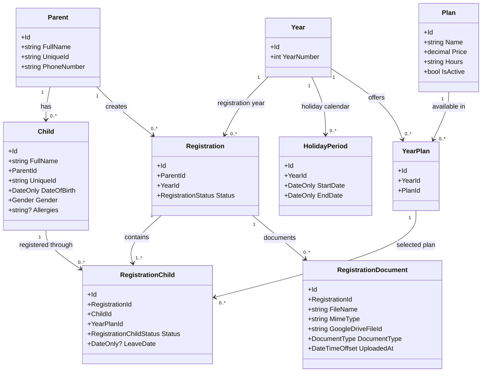

# Software Design Specification

## 1. Document Information

**Project:** Daycare Registration System  
**Document Type:** Software Design Specification (SDS)  
**Status:** Draft / Living Document  
**Last Updated:** 2026-08-16

---

## 2. Purpose

This document describes the software architecture, design decisions, application structure, data model, integrations, infrastructure, and implementation conventions for the daycare registration system.

The document is intended to act as the technical source of truth during development and should be updated whenever a significant architectural or design decision changes.

---

## 3. User Stories

### 3.1 Login

#### Parent Flow

**P-US-001 — Login Using Email OTP**

As a parent,  
I want to log in using my email address and a one-time password sent to my email,  
so that I can securely access my registrations without maintaining a password.

Flow:

```text
Enter email
    |
    v
Validate that the email belongs to a known Parent
    |
    v
Generate OTP
    |
    v
Send OTP through IEmailService
    |
    v
Parent enters OTP
    |
    v
Verify OTP
    |
    v
Create authenticated application session
```

If the email does not belong to a known parent, authentication is rejected.

---

#### Admin Flow

**A-US-001 — Login Using Email OTP**

As an admin,  
I want to log in using my predefined admin email address and a one-time password sent to my email,  
so that I can securely access the administrative application without maintaining a password.

There are currently two predefined administrators in the system.

Flow:

```text
Enter email
    |
    v
Validate that the email belongs to a predefined Admin
    |
    +---- No ----> Reject admin login
    |
    +---- Yes
            |
            v
        Generate OTP
            |
            v
        Send OTP through IEmailService
            |
            v
        Admin enters OTP
            |
            v
        Verify OTP
            |
            v
        Create authenticated admin session
```

---

#### Shared Login Logic

The parent and admin login flows use the same authentication mechanism:

```text
Email
  |
  v
OTP challenge
  |
  v
IAuthService
  |
  v
Authentication cookie
```

Shared rules:

- OTP is sent through the configured `IEmailService`.
- The MVP email provider is the dedicated Gmail account.
- OTP codes expire after a configurable short period.
- A newly issued OTP replaces the previous active OTP for the same login attempt/user.
- OTP codes must never be logged.
- After successful OTP verification, the backend creates the same type of application authentication session for both user types.
- The session has a configurable expiration.
- Authentication determines identity; authorization determines whether that identity has Parent or Admin access.
- The frontend does not store the authentication credential directly.
- `GET /api/auth/me` is used to restore the authenticated user after refresh.
- Google authentication may be added later behind `IAuthService` without changing application business logic.

The role resolution differs only by identity source:

```text
Parent login
    -> resolve Parent by Email

Admin login
    -> resolve predefined Admin by Email
```

---


### 3.2 Registration

Registration is available only to the **Parent** user type.

A registration belongs to one parent and one year and may contain multiple children.

The registration process contains four stages:

```text
1. Parent Details
2. Plan Selection
3. Documents Upload
4. Submitted Registration Summary
```

#### P-US-002 — Complete Registration

As a parent,  
I want to complete and submit a registration for one or more of my children,  
so that the daycare admin can review it.

---

##### Stage 1 — Parent Details

The parent enters or updates:

```text
FullName
PhoneNumber
Email
```

The parent is not required to enter database/internal identifiers.

When this stage is completed, the frontend draft advances to:

```text
CurrentStep = PlanSelection
```

The draft is not yet a backend `Registration`.

For the MVP, serializable draft data is stored in browser `localStorage` so the parent can stop and continue later.

---

##### Stage 2 — Plan Selection

The parent adds one or more children.

For each child, the parent enters:

```text
FullName
DateOfBirth
Gender
Allergies?
```

The parent selects one plan independently for each child.

Different children in the same registration may use different plans.

```text
Registration
|
+-- Child A
|    +-- Plan A
|
+-- Child B
     +-- Plan B
```

###### Multiple-Child Discount

When the registration contains more than one child, the UI must clearly inform the parent that the **second child receives a 10% discount on the selected plan price**.

Example:

```text
Child A
Plan price: 1,000

Child B
Plan price: 1,000
Second-child discount: 10%
Final price: 900
```

The discount must be visible during plan selection before the parent continues.

The frontend may display the calculated discounted price, but the backend remains authoritative for the final price calculation.

When this stage is completed, the frontend draft advances to:

```text
CurrentStep = DocumentsUpload
```

The draft remains browser-local until the parent explicitly submits it.

---

##### Stage 3 — Documents Upload

The parent uploads the documents required for the registration.

There are currently two document types:

```text
1. Signed Contract
2. Standing-Order Approval (הוראת קבע)
```

The parent is not required to provide all documents before submitting the registration.

While the registration is still a local draft, the backend does not have a `Registration` record yet.

The parent may:

```text
Choose some documents
        |
        +-- submit with only those documents
        |
        +-- submit with no documents yet
```

On Submit, the backend creates the registration and uploads any files currently supplied by the parent.

After submission, additional missing documents can be uploaded directly to the persisted registration.

**MVP local-draft limitation:** browser `localStorage` stores only serializable draft data. File contents are not persisted in `localStorage`, so files selected before Submit must be selected again after a browser reload/close if they were not submitted.

###### Signed Contract

A signed contract is required for the registration.

When multiple children are registered together, the parent can choose between:

**Option A — One shared contract**

Upload one signed contract that applies to all children in the registration.

```text
Registration
|
+-- Signed Contract
|      Scope: All Children
|
+-- Child A
+-- Child B
```

**Option B — Separate contract per child**

Upload an individual signed contract for each child.

```text
Registration
|
+-- Child A
|      +-- Signed Contract A
|
+-- Child B
       +-- Signed Contract B
```

The UI must allow the parent to choose which upload approach is being used.

The signed-contract requirement is complete when either:

```text
One shared signed contract exists
```

or:

```text
Every child has an individual signed contract
```

###### Standing-Order Approval — הוראת קבע

The same shared/per-child upload logic applies to the standing-order approval.

For registrations containing multiple children, the parent may choose:

**Option A — One shared standing-order approval**

```text
Registration
|
+-- Standing-Order Approval
|      Scope: All Children
|
+-- Child A
+-- Child B
```

**Option B — Separate approval per child**

```text
Registration
|
+-- Child A
|      +-- Standing-Order Approval A
|
+-- Child B
       +-- Standing-Order Approval B
```

The standing-order requirement depends on the selected plan.

```text
Monthly plan
    -> standing-order approval is normally required

Daily plan
    -> standing-order approval is not required
```

If a registration contains both monthly-plan and daily-plan children, the standing-order requirement applies only to children whose plans require it.

Example:

```text
Child A
Monthly Plan
-> Standing-order approval required

Child B
Daily Plan
-> Standing-order approval not required
```

A shared standing-order document may cover all children for whom the document is required.

###### Cash-Payment Exception

The application does not know during registration whether the parent and admin have privately agreed that a monthly-plan child will pay in cash.

Therefore, from the parent's registration flow, a monthly plan is treated as normally requiring a standing-order approval.

The parent is still allowed to submit without uploading it.

If the admin later confirms cash payment, the admin may set:

```text
PaymentMethod = Cash
```

and the missing standing-order document is no longer considered an outstanding requirement for that child.

###### Current-Year Contract Download

During the Documents Upload stage, the parent can download the current contract belonging to the registration year.

```text
Registration
    |
    v
Year
    |
    v
Current Contract
```

The parent can download the contract, sign it, and upload the signed version.

---

##### Stage 4 — Submitted Registration Summary

After the parent explicitly submits the registration, the application displays a read-only registration summary.

The summary includes:

```text
Registration year

Parent details

Children
  -> Child details
  -> Selected plan
  -> Applied discount when relevant

Uploaded documents
Missing required documents, if any

Registration status
```

If the registration status is `WaitingForDocuments`, the summary must allow the parent to continue uploading missing documents.

---

##### Submission Rules

Submission is an explicit parent action.

If the parent leaves the registration without pressing Submit, no backend registration is created.

The frontend keeps a local draft:

```text
RegistrationDraft
CurrentStep = <last editable stage>
Stored in browser localStorage
```

This local draft is not part of the parent's account data or registration history.

If the parent presses Submit and required documents are missing:

```text
Backend Registration created
Status = WaitingForDocuments
```

The registration is still considered submitted.

If the parent presses Submit and all required documents are present:

```text
Backend Registration created
Status = PendingApproval
```

If a submitted registration is in `WaitingForDocuments` and all missing requirements are later satisfied:

```text
WaitingForDocuments
        |
        v
PendingApproval
```

The backend determines document completeness and remains authoritative for these transitions.

---

##### Registration Status Flow

```text
Start Registration
        |
        v
Local Draft (browser only)
        |
        +-- Parent Details
        |
        +-- Plan Selection
        |
        +-- Documents Upload
        |
        +---- parent exits without Submit
        |           |
        |           v
        |   Local draft remains in localStorage
        |
        +---- parent presses Submit
                    |
                    v
          Backend Registration created
                    |
                    v
       Are required documents complete?
                    |
                   / \
                 Yes  No
                  |    |
                  v    v
         PendingApproval  WaitingForDocuments
                  |               |
                  |               +-- upload missing documents
                  |                           |
                  +---------------------------+
                              |
                              v
                       PendingApproval
                              |
                              v
                         Admin Review
                         /          \
                    Approved       Rejected
```

A persisted registration may also be:

```text
Cancelled
```

Cancellation does not delete its saved backend data.

---

##### Resume Behavior

Before Submit, registration progress belongs only to the frontend draft.

The frontend stores serializable draft data in browser `localStorage`, including:

```text
CurrentStep
Parent details entered in the wizard
Children
Selected plans
Document scope choices / serializable metadata
UpdatedAt
```

When the parent returns on the same browser, the Registration Signal Store restores the draft from `localStorage`.

The draft is **not** returned by the backend and is **not** part of the parent's registration history.

After Submit, the backend registration becomes the source of truth.

A submitted registration with:

```text
Status = WaitingForDocuments
```

can still receive missing document uploads from the submitted-registration summary.

---

##### Document Scope Requirement

A registration document must support either shared scope or child-specific scope.

Conceptually:

```text
RegistrationDocument
--------------------
Id
RegistrationId
RegistrationChildId?
Scope
DocumentType
...
```

Where:

```text
Scope = AllChildren
```

or:

```text
Scope = SpecificChild
RegistrationChildId = <child registration id>
```

This allows the same document model to support:

- one signed contract for all children,
- one signed contract per child,
- one standing-order approval for all relevant children,
- one standing-order approval per child.

The exact persistence shape may be refined during entity/API design, but the business capability is required.

---


#### P-US-003 — Continue Local Draft

As a parent,  
I want to continue an unsubmitted registration draft saved in this browser,  
so that I do not need to re-enter registration details I already completed.

The draft exists only in the frontend and is loaded from browser `localStorage`.

```text
Registration
    |
    +-- Continue Local Draft
            |
            v
      RegistrationStore restores local draft
            |
            v
      Resume from CurrentStep
```

This action is available only when a valid local draft exists in the current browser.

The draft:

```text
Is not part of the parent's account data
Is not returned by the backend
Does not appear in registration history
Does not have a backend RegistrationId
```

The frontend restores the serializable registration draft, including:

```text
CurrentStep
Parent details
Children
Selected plans
Document scope choices / serializable metadata
```

For the MVP, file contents are not stored in browser `localStorage`. If the browser is reloaded or closed before Submit, previously selected files must be selected again.

When the parent explicitly submits the registration:

```text
Local Draft
    |
    v
Backend Registration created
    |
    +-- WaitingForDocuments
    |
    +-- PendingApproval
```

After successful submission, the frontend clears the local draft from `localStorage`.

---

### 3.3 Parent Home

The Parent Home screen is shown after a parent successfully logs in.

It displays backend account data for submitted registrations.

#### P-US-004 — View Parent Home

As a parent,  
I want to see my current daycare-registration information after logging in,  
so that I can quickly understand my active registration, previous registrations, and current-year calendar.

The screen contains:

```text
Active Submitted Registration, if one exists
Registration History
Current-Year Holiday Calendar
```

#### P-US-005 — View Active Registration

As a parent,
I want to see the details and status of my current submitted registration,
so that I know its current state and any action still required from me.

If a current submitted registration exists, the Home screen may display:

```text
Registration status
Children
Selected plans
Missing documents, when applicable
```

---

#### P-US-006 — View Registration History

As a parent,  
I want to see my submitted registrations from previous years,  
so that I can review my registration history.

A parent may have registrations across multiple years.

Example:

```text
2025 -> Approved
2026 -> Approved
2027 -> PendingApproval
```

Only registrations that were explicitly submitted and persisted in the backend are part of this history.

Selecting a historical registration opens its submitted registration summary.

---


---

#### P-US-007 — Complete Missing Documents for a Submitted Registration

As a parent,  
I want to upload missing documents for a registration that I already submitted,  
so that it can become ready for admin approval.

This applies when:

```text
Status = WaitingForDocuments
```

The parent opens the submitted registration summary and uploads the missing documents.

The editable pre-submission wizard is not reopened.

When backend document requirements become complete:

```text
WaitingForDocuments
        |
        v
PendingApproval
```

---

#### P-US-008 — View Current-Year Holiday Calendar

As a parent,  
I want to see the holiday/closure calendar for the active year,  
so that I know when the daycare is closed.

Only `HolidayPeriod` records belonging to the current registration year are displayed.

```text
Current Registration Year
    |
    +-- HolidayPeriod
    +-- HolidayPeriod
    +-- HolidayPeriod
```

The calendar reflects the latest holiday periods maintained by the admin.

---

#### Parent Home Rules

```text
WaitingForDocuments
    -> Show submitted summary
    -> Allow missing-document uploads

PendingApproval
    -> Show submitted summary

Approved
    -> Show submitted summary

Rejected
    -> Show submitted summary

Cancelled
    -> Show submitted summary
    -> Reopen action may be shown according to cancellation rules
```

The backend remains authoritative for submitted registration data, registration status, current registration year, and holiday calendar.

---

## 4. System Overview

The system is a **mobile-first responsive web application** used to manage daycare registration and related administrative processes.

The solution consists of:

- An Angular-based client application.
- A .NET backend API.
- SQL Server for relational application data.
- Google Drive for uploaded contract/document storage.
- Seq for structured application logging.

### 4.1 High-Level Architecture

```text
+--------------------------+
|      Angular Client      |
|  Mobile-first Web App    |
+------------+-------------+
             |
             | HTTPS / REST
             v
+--------------------------+
|       .NET Backend       |
|      ASP.NET Core API    |
+------+-----------+-------+
       |           |
       |           |
       v           v
+-------------+  +----------------+
| SQL Server  |  | Google Drive   |
| App Data    |  | File Storage   |
+-------------+  +----------------+

             |
             v
       +------------+
       |    Seq     |
       |  Logging   |
       +------------+
```

---

## 5. Technology Stack

### 5.1 Frontend

- **Framework:** Angular
- **UI primitives:** Spartan NG
- **State management:** NgRx Signal Store
- **Application style:** Mobile-first responsive SPA
- **Communication:** REST API over HTTPS

### 5.2 Backend

- **Framework:** ASP.NET Core / .NET
- **API style:** REST
- **Persistence:** Entity Framework Core
- **Database:** SQL Server
- **Logging:** Serilog with Seq sink

### 5.3 External Services

- **Document storage:** Google Drive
- **Structured log server:** Seq

---

## 6. Frontend Architecture

### 6.1 General Principles

The Angular application should be organized around application features rather than technical layer folders whenever practical.

Each feature should own:

- Components
- Local state
- Models
- API interactions
- Feature-specific utilities

Shared functionality should only be moved to shared infrastructure when it is genuinely reusable across features.

### 6.2 State Management

NgRx Signal Store is the standard state-management mechanism.

Two state scopes are used:

#### Global State

Global state is reserved for information that is required across multiple unrelated application areas.

Examples:

- Current user/session
- Authentication state
- Global application configuration
- Global loading state when appropriate
- Application-wide notifications

#### Local / Feature State

Each significant component or feature owns its own local Signal Store.

A component store should manage:

- Component data
- Loading state
- Error state
- User selections
- Form-related state when appropriate
- API request state
- Derived/computed values

### 6.3 Component Design

Components should remain primarily responsible for:

- Rendering
- User interaction
- Delegating actions to their store
- Binding store state to the view

Business logic should not be embedded directly in templates.

Complex business rules should live in:

- Signal stores
- Domain/application services
- Backend services

depending on where the rule belongs.

### 6.4 UI Component Library

Spartan NG is used as the primitive component library.

Application-specific UI components should be built by composing Spartan NG primitives rather than duplicating primitive UI behavior.

Examples:

- Buttons
- Inputs
- Dialogs
- Select controls
- Tabs
- Tables
- Form controls

### 6.5 Responsive Design

The application is designed **mobile-first**.

Breakpoints should progressively enhance the interface for:

1. Mobile
2. Tablet
3. Desktop

The mobile workflow must remain fully functional without depending on desktop-only UI patterns.

---


## 6.6 Frontend Facades

The Angular application uses frontend facades as a boundary between state stores and the shared `DataService`.

The frontend facades mirror the two primary application experiences:

```text
ParentFacade
AdminFacade
```

Authentication may use a separate:

```text
AuthFacade
```

The facades are intentionally **stateless**.

NgRx Signal Store remains responsible for application/feature state.

Conceptually:

```text
Angular Component
       |
       v
Signal Store
       |
       v
Frontend Facade
       |
       v
DataService
       |
       v
.NET Backend
```

The facade does not replace Signal Store.

### 6.6.1 Responsibility Split

```text
Component
---------
Render UI
Handle user interaction
Bind to signals
Call store methods

Signal Store
------------
Own feature/local state
Loading state
Error state
Selected values
Computed state
Invoke frontend facade operations
Patch state from results

Frontend Facade
---------------
Expose use-case-oriented operations
Coordinate multiple backend calls when needed
Map API DTOs to frontend models when useful
Hide endpoint/HTTP details from stores
Normalize API errors when useful

DataService
-----------
HTTP transport
Base API URL
Serialization/deserialization
Uploads/downloads
Common request/error handling
```

Guiding rule:

```text
Store owns state.
Facade performs application operations.
DataService performs HTTP.
```

---

## 6.7 Parent Frontend Facade

The parent facade exposes backend operations required by parent-facing feature stores.

Unsubmitted draft creation and step persistence do **not** go through the facade because the MVP draft is browser-local.

Conceptual contract:

```ts
@Injectable({ providedIn: 'root' })
export class ParentFacade {
  getHome(): Promise<ParentHomeDto>;

  getRegistrations(): Promise<RegistrationSummaryDto[]>;

  getRegistration(
    registrationId: number
  ): Promise<RegistrationStateDto>;

  submitRegistration(
    request: SubmitRegistrationRequest
  ): Promise<RegistrationStateDto>;

  cancelRegistration(
    registrationId: number
  ): Promise<void>;

  reopenRegistration(
    registrationId: number
  ): Promise<RegistrationStateDto>;

  uploadDocument(
    registrationId: number,
    file: File,
    documentType: DocumentType,
    scope: RegistrationDocumentScope
  ): Promise<RegistrationDocumentDto>;

  deleteDocument(
    registrationId: number,
    documentId: number
  ): Promise<void>;
}
```

### Registration Store Responsibility

The `RegistrationStore` owns the unsubmitted draft and synchronizes its serializable state with browser `localStorage`.

```text
RegistrationComponent
        |
        v
RegistrationStore
        |
        +-- local draft state
        +-- currentStep
        +-- localStorage synchronization
        |
        +-- Submit
                |
                v
          ParentFacade
                |
                v
             Backend
```

After Submit succeeds:

```text
1. Backend returns persisted RegistrationState
2. RegistrationStore clears the local draft
3. UI moves to Submitted Registration Summary
```

The facade does not maintain duplicate registration state.

## 6.8 Admin Frontend Facade

The admin facade exposes administrative use cases.

Conceptual contract:

```ts
@Injectable({ providedIn: 'root' })
export class AdminFacade {
  getDashboard(): Promise<AdminDashboardDto>;

  getRegistrations(
    query: RegistrationQuery
  ): Promise<PagedResult<RegistrationSummaryDto>>;

  getRegistration(
    registrationId: number
  ): Promise<RegistrationStateDto>;

  updateRegistrationStatus(
    registrationId: number,
    status: RegistrationStatus
  ): Promise<void>;

  getYears(): Promise<YearDto[]>;

  createYear(
    request: CreateYearRequest
  ): Promise<YearDto>;

  getPlans(): Promise<PlanDto[]>;

  createPlan(
    request: CreatePlanRequest
  ): Promise<PlanDto>;

  updatePlan(
    planId: number,
    request: UpdatePlanRequest
  ): Promise<PlanDto>;

  setPlanActive(
    planId: number,
    isActive: boolean
  ): Promise<void>;

  assignPlanToYear(
    yearId: number,
    planId: number
  ): Promise<void>;

  removePlanFromYear(
    yearId: number,
    planId: number
  ): Promise<void>;

  getHolidayPeriods(
    yearId: number
  ): Promise<HolidayPeriodDto[]>;

  addHolidayPeriod(
    yearId: number,
    request: CreateHolidayPeriodRequest
  ): Promise<HolidayPeriodDto>;

  updateHolidayPeriod(
    holidayPeriodId: number,
    request: UpdateHolidayPeriodRequest
  ): Promise<HolidayPeriodDto>;

  deleteHolidayPeriod(
    holidayPeriodId: number
  ): Promise<void>;
}
```

Admin stores consume this facade rather than using `DataService` or `HttpClient` directly.

---

## 6.9 Auth Frontend Facade

Authentication should also be hidden behind a frontend facade.

Conceptually:

```ts
@Injectable({ providedIn: 'root' })
export class AuthFacade {
  login(phoneNumber: string): Promise<CurrentUserDto>;

  logout(): Promise<void>;

  getCurrentUser(): Promise<CurrentUserDto | null>;
}
```

This keeps the Angular authentication store independent of the current authentication mechanism.

Today:

```text
Phone number
```

Future:

```text
Email OTP
Google sign-in
```

The frontend stores/components do not need to know how the backend authenticates the user.

---

## 6.10 Facade to DataService Boundary

Frontend facades use the shared `DataService` directly for backend communication.

Preferred structure:

```text
ParentFacade
    |
    v
DataService

AdminFacade
    |
    v
DataService

AuthFacade
    |
    v
DataService
```

Example:

```ts
@Injectable({ providedIn: 'root' })
export class ParentFacade {
  private readonly dataService = inject(DataService);

  getRegistration(id: number) {
    return this.dataService.get<RegistrationStateDto>(
      `/api/parent/registrations/${id}`
    );
  }
}
```

The facade owns endpoint/use-case knowledge.

`DataService` owns only generic HTTP transport concerns.

A facade may appear thin initially. That is acceptable because it provides a stable boundary for:

- multi-call orchestration,
- DTO/model mapping,
- error normalization,
- endpoint changes,
- future client-side caching policies.

Avoid adding another generated/domain API-client layer unless a concrete need emerges.

---

## 6.11 Frontend Facade Rules

### Facades should:

- Represent user/application use cases.
- Hide endpoint and HTTP details from feature stores/components.
- Coordinate multiple HTTP calls when a use case requires them.
- Return strongly typed results.
- Keep backend DTO handling out of presentation components.
- Remain reusable across multiple feature stores where appropriate.

### Facades should not:

- Own feature state already stored in Signal Store.
- Duplicate loading/error signals.
- Manipulate DOM/UI components.
- Contain presentation decisions.
- Access local component state directly.
- Become generic HTTP wrappers such as `get<T>()`, `post<T>()`.
- Replace feature stores.

### Avoid this

```text
Component
    |
    +--> HttpClient
    +--> DataService
```

### Prefer this

```text
Component
    |
    v
Feature Store
    |
    v
Frontend Facade
    |
    v
DataService
```

---

## 6.12 Global vs Local State with Facades

Frontend facades do not change the existing state-management decision.

Global Signal Store remains limited to cross-application state such as:

```text
Current authenticated user
Authentication state
Global application configuration
Global notifications when required
```

Feature/local stores continue owning feature-specific state.

Examples:

```text
RegistrationStore
AdminRegistrationsStore
PlansStore
YearSettingsStore
HolidayCalendarStore
```

Each store may use the appropriate facade.

Example:

```text
PlansStore
    |
    v
AdminFacade
    |
    v
DataService
```

This allows multiple stores to share use-case operations without sharing mutable state unnecessarily.


## 6.13 Frontend Domain Models

The frontend must not mirror EF Core entities blindly.

Backend entities represent persistence and relational structure.

Frontend models represent the data required by Angular features and Signal Stores.

The preferred flow is:

```text
Backend Entity
    |
    v
API DTO
    |
    v
Frontend Facade
    |
    v
Frontend Model / Store State
```

When an API DTO already has exactly the shape required by the frontend, the facade may return it directly.

When the frontend needs a different shape, the facade maps the API DTO to a frontend model.

### Naming Convention

Recommended naming:

```text
Backend entity:
Registration

API DTO:
RegistrationStateDto
RegistrationSummaryDto

Frontend model:
RegistrationState
RegistrationSummary
```

Do not suffix normal frontend domain models with `Entity`.

---

## 6.14 Parent Model

Frontend model:

```ts
export interface Parent {
  id: number;
  fullName: string;
  phoneNumber: string;
}
```

### Difference from Backend

Backend:

```text
Parent
------
Id
FullName
UniqueId
PhoneNumber
```

Frontend default:

```text
Parent
------
id
fullName
phoneNumber
```

`UniqueId` should only be returned to the frontend when a screen/use case explicitly requires it.

This avoids exposing unnecessary personal information.

If a specific flow requires it, use a more specific DTO/model such as:

```ts
export interface ParentRegistrationDetails extends Parent {
  uniqueId: string;
}
```

---

## 6.15 Child Model

```ts
export interface Child {
  id: number;
  fullName: string;
  uniqueId: string;
  dateOfBirth: string;
  gender: Gender;
  allergies?: string | null;
}
```

The frontend does not normally need `ParentId` inside every child object because the child is already loaded in the authenticated parent's context.

If an admin screen requires parent ownership information, it should be provided by the admin-specific DTO.

### Date Representation

Backend:

```text
DateOnly
```

Frontend/API:

```text
ISO date string: YYYY-MM-DD
```

Example:

```text
2021-03-14
```

Avoid converting date-only business values to JavaScript timestamps unnecessarily.

---

## 6.16 Plan Model

```ts
export interface Plan {
  id: number;
  name: string;
  price: number;
  hours: string;
  isActive: boolean;
}
```

This is intentionally very close to the backend entity.

For parent-facing plan selection, inactive plans should normally be filtered by the backend/facade and not returned as selectable options.

Admin screens may receive both active and inactive plans.

---

## 6.17 Year Model

Backend:

```text
Year
----
Id
YearNumber
```

Frontend:

```ts
export interface Year {
  id: number;
  yearNumber: number;
}
```

The persisted model remains identical.

### Active Year

The frontend must not implement its own independent active-year state.

The business rule is:

```text
ActiveYear = MAX(YearNumber)
```

Preferred API shape where active-year information is needed:

```ts
export interface YearContext {
  activeYear: Year;
  years: Year[];
}
```

This keeps the active-year rule centralized rather than duplicated across components.

---

## 6.18 Holiday Period Model

```ts
export interface HolidayPeriod {
  id: number;
  yearId: number;
  startDate: string;
  endDate: string;
}
```

Date values use ISO date strings:

```text
YYYY-MM-DD
```

This model closely matches the backend entity.

---

## 6.19 Registration Status and Draft Step

Backend-persisted registration statuses:

```ts
export enum RegistrationStatus {
  WaitingForDocuments = 'WaitingForDocuments',
  PendingApproval = 'PendingApproval',
  Approved = 'Approved',
  Rejected = 'Rejected',
  Cancelled = 'Cancelled'
}
```

`Draft` is not a backend registration status in the MVP.

The editable registration wizard uses a frontend-only step enum:

```ts
export enum RegistrationDraftStep {
  ParentDetails = 'ParentDetails',
  PlanSelection = 'PlanSelection',
  DocumentsUpload = 'DocumentsUpload'
}
```

After Submit, the UI shows the Submitted Registration Summary based on the persisted registration status; it is not an editable draft step.

---

## 6.20 Registration Summary Model

Registration-list screens use a lightweight projection of submitted backend registrations.

```ts
export interface RegistrationSummary {
  id: number;
  year: Year;
  status: RegistrationStatus;
  children: RegistrationChildSummary[];
}

export interface RegistrationChildSummary {
  childId: number;
  childName: string;
  planName?: string | null;
  status: RegistrationChildStatus;
}
```

Draft-specific properties such as `CurrentStep` do not appear because browser-local drafts are not backend registrations.

This model is used for Parent Home/history and admin registration lists.

---

## 6.21 Registration Child State Model

The backend entity stores foreign keys:

```text
RegistrationChild
-----------------
Id
RegistrationId
ChildId
YearPlanId
Status
LeaveDate?
```

The frontend should normally receive the related objects together.

Recommended frontend model:

```ts
export interface RegistrationChildState {
  id: number;

  child: Child;

  selectedPlan: SelectedYearPlan | null;

  status: RegistrationChildStatus;

  leaveDate?: string | null;
}
```

```ts
export interface SelectedYearPlan {
  yearPlanId: number;
  plan: Plan;
}
```

This allows the UI to render:

```text
Child name
Child details
Selected plan
Plan price
Plan hours
Child yearly status
```

without performing additional lookups by foreign key.

### Why Keep `yearPlanId`

The UI normally cares about the `Plan`, but mutation requests may need the specific `YearPlan` relationship identifier.

Therefore:

```text
selectedPlan.plan
```

is used for display, while:

```text
selectedPlan.yearPlanId
```

is available for update commands.

---

## 6.22 Registration Document Model

```ts
export interface RegistrationDocument {
  id: number;
  fileName: string;
  mimeType: string;
  documentType: DocumentType;
  uploadedAt: string;
}
```

The frontend should **not require or normally receive**:

```text
GoogleDriveFileId
```

That identifier is an infrastructure detail.

Document download/view operations should use the application's document ID:

```text
/api/parent/registrations/{registrationId}/documents/{documentId}
```

and the backend resolves the Google Drive file internally.

This keeps Google Drive completely hidden from Angular.

---

## 6.23 Registration State and Local Draft Models

### Persisted Registration State

`RegistrationState` represents a registration that has already been submitted to the backend.

```ts
export interface RegistrationState {
  id: number;
  year: Year;
  status: RegistrationStatus;
  parent: ParentRegistrationDetails;
  children: RegistrationChildState[];
  documents: RegistrationDocument[];
}
```

It intentionally contains no `CurrentStep` because the editable wizard no longer exists after submission.

### Local Registration Draft

The unsubmitted registration is a frontend-only model:

```ts
export interface RegistrationDraft {
  year: Year;
  currentStep: RegistrationDraftStep;
  parentDetails: ParentRegistrationDetails;
  children: RegistrationChildDraft[];
  updatedAt: string;
}
```

The Registration Signal Store synchronizes this serializable model with browser `localStorage`.

`File` objects are not persisted in `localStorage`.

Selected document files may exist in Signal Store memory during the current browser session, but must be reselected after a reload/close if the registration has not yet been submitted.

On successful Submit, the backend returns a persisted `RegistrationState` and the local draft is deleted.

---

## 6.24 Registration Child Status

```ts
export enum RegistrationChildStatus {
  Active = 'Active',
  Left = 'Left'
}
```

A child that left remains in the registration state.

Example:

```ts
{
  status: RegistrationChildStatus.Left,
  leaveDate: '2027-02-12'
}
```

This allows historical data to remain visible in admin views and appropriate parent views.

---

## 6.25 Year Plan Models

`YearPlan` is primarily a backend relational concept, but it is also useful for plan-selection/admin screens.

Parent-facing selection model:

```ts
export interface AvailableYearPlan {
  yearPlanId: number;
  plan: Plan;
}
```

Admin model:

```ts
export interface YearPlan {
  id: number;
  yearId: number;
  plan: Plan;
}
```

The parent UI should generally receive only active plans assigned to the selected year.

Admin UI may receive inactive plans and plans not currently assigned to a year when managing configuration.

---

## 6.26 Parent Home Model

The backend response contains only persisted account data:

```ts
export interface ParentHome {
  parent: Parent;
  activeRegistration?: RegistrationSummary | null;
  registrationHistory: RegistrationSummary[];
  holidayPeriods: HolidayPeriod[];
}
```

---

## 6.27 Admin Models

Admin screens may require richer models than parent screens.

Examples:

```ts
export interface AdminRegistrationSummary {
  id: number;

  parentId: number;
  parentName: string;

  year: Year;

  status: RegistrationStatus;

  childrenCount: number;
}
```

Admin models may intentionally contain cross-aggregate display information to avoid multiple API requests.

They should still avoid exposing infrastructure details such as:

```text
GoogleDriveFileId
SMTP configuration
OAuth tokens
database-specific identifiers beyond application IDs
```

---

## 6.28 Frontend Model Rules

### Prefer frontend-specific models when:

- A screen needs data from several backend entities.
- Foreign-key relationships are more useful as nested objects.
- A list screen needs a lightweight projection.
- Infrastructure properties should be hidden.
- The UI needs derived/display-oriented data.

### Prefer direct DTO reuse when:

- The API DTO already has exactly the required shape.
- No UI-specific mapping adds value.
- Reusing the contract keeps the implementation simpler.

### Avoid

```text
EF entity -> JSON -> Angular
```

as a direct persistence-to-UI contract.

Instead:

```text
Backend persistence entity
        |
        v
API DTO
        |
        v
Frontend facade
        |
        v
Frontend model / Signal Store
```

This allows backend persistence and frontend presentation to evolve independently.


## 6.29 Frontend Shared Services

The Angular frontend may use a small set of shared infrastructure services.

The goal is to centralize technical/browser concerns without moving business state out of Signal Store or use-case orchestration out of facades.

Recommended frontend-wide services:

```text
DataService
NotificationService
```

---

## 6.30 DataService

`DataService` is the single low-level HTTP transport abstraction used by frontend facades.

It is responsible for generic HTTP concerns only.

Conceptually:

```text
Component
    |
    v
Signal Store
    |
    v
Facade
    |
    v
DataService
    |
    v
Angular HttpClient
    |
    v
.NET Backend
```

### Responsibilities

`DataService` may handle:

- Base API URL.
- GET / POST / PUT / PATCH / DELETE calls.
- Query parameters.
- JSON serialization/deserialization.
- Multipart file uploads.
- Binary/blob downloads.
- Common HTTP error normalization.
- Shared request options.
- Authentication cookies via normal browser behavior.
- Optional request/correlation headers if needed.

Example interface:

```ts
@Injectable({ providedIn: 'root' })
export class DataService {
  get<T>(
    url: string,
    options?: RequestOptions
  ): Promise<T>;

  post<TResponse, TRequest = unknown>(
    url: string,
    body?: TRequest,
    options?: RequestOptions
  ): Promise<TResponse>;

  put<TResponse, TRequest = unknown>(
    url: string,
    body: TRequest,
    options?: RequestOptions
  ): Promise<TResponse>;

  delete<T>(
    url: string,
    options?: RequestOptions
  ): Promise<T>;

  upload<T>(
    url: string,
    formData: FormData
  ): Promise<T>;

  download(
    url: string
  ): Promise<Blob>;
}
```

The exact async type (`Promise` vs `Observable`) should follow the application's Angular conventions.

### DataService Must Not

`DataService` must not contain application/domain methods such as:

```text
submitRegistration()
cancelRegistration()
createPlan()
addHoliday()
```

Those belong to facades.

Avoid turning `DataService` into a giant application API service.

Preferred separation:

```text
ParentFacade.submitRegistration()
        |
        v
DataService.post(...)
```

rather than:

```text
DataService.submitRegistration()
```

### HTTP Interceptors

Cross-cutting request behavior should normally be implemented with Angular HTTP interceptors rather than manually repeated inside every `DataService` call.

Potential interceptors:

```text
ErrorInterceptor
CorrelationIdInterceptor   // optional
```

Because authentication uses an HTTP-only cookie, Angular does not manually attach an authentication token.

---

## 6.31 NotificationService

A shared `NotificationService` may be used for application-level user feedback.

Examples:

```text
Registration saved
Registration submitted
Document upload failed
Plan updated
Holiday period added
```

Conceptual interface:

```ts
export interface NotificationService {
  success(message: string): void;
  error(message: string): void;
  warning(message: string): void;
  info(message: string): void;
}
```

The implementation may use the selected Spartan NG/toast primitive.

The service owns notification presentation plumbing, not business decisions.

For example:

```text
RegistrationStore
    |
    +-- ParentFacade.submitRegistration()
    |
    +-- NotificationService.success(...)
```

Whether the store or facade triggers a notification should be consistent.

Recommended rule:

```text
Facade returns result/error.
Store decides user-facing notification.
```

This keeps facades reusable outside a specific screen.

---


## 6.32 Frontend Service Summary

Recommended MVP frontend architecture:

```text
Components
    |
    v
Signal Stores
    |
    +-- NotificationService
    |
    v
Facades
    |
    v
DataService
    |
    v
HttpClient
```

Avoid unnecessary generic services such as:

```text
HelperService
CommonService
UtilityService
```

unless they have one clearly defined responsibility.


## 7. Backend Architecture

### 7.1 Backend Responsibilities

The .NET backend is responsible for:

- Business rules
- Registration workflows
- Data validation
- Database persistence
- Document metadata management
- Google Drive integration
- Logging and diagnostics
- Authorization rules
- API contracts

### 7.2 Recommended Logical Layers

```text
API
 |
 v
Application
 |
 v
Domain
 |
 v
Infrastructure
```

#### API Layer

Responsibilities:

- Controllers / endpoints
- Request parsing
- Authentication/authorization boundary
- HTTP status codes
- Mapping API contracts to application commands/queries

#### Application Layer

Responsibilities:

- Use cases
- Workflow orchestration
- Application services
- Commands and queries
- Validation
- Transaction boundaries

#### Domain Layer

Responsibilities:

- Core business entities
- Business rules
- Domain value objects
- Domain-specific behavior

The domain layer should not depend on infrastructure.

#### Infrastructure Layer

Responsibilities:

- EF Core
- SQL Server
- Google Drive integration
- Email integration
- Logging infrastructure
- External APIs

---


## 7.3 Persistence Abstraction

The application layer must not depend directly on EF Core or a specific database provider.

Although EF Core already abstracts many database differences, direct use of `DbContext` throughout the application would still couple business/application code to EF Core query APIs and provider-specific behavior.

To preserve the option of moving from SQL Server to another database in the future, persistence is exposed through small domain-oriented repository interfaces.

Conceptually:

```text
ParentFacade / AdminFacade
          |
          v
Application Services
          |
          v
Repository Interfaces
          |
          v
EF Core Repository Implementations
          |
          v
AppDbContext
          |
          v
SQL Server
```

Future replacement:

```text
Repository Interfaces
          |
          +--> EF Core + SQL Server      <- MVP
          |
          +--> EF Core + PostgreSQL      <- possible future
          |
          +--> another persistence implementation
```

### Repository Design

Avoid a generic abstraction such as:

```csharp
public interface IDatabaseService
{
    Task<T> GetAsync<T>(...);
    Task InsertAsync<T>(T entity);
    Task UpdateAsync<T>(T entity);
    Task DeleteAsync<T>(T entity);
}
```

This leaks persistence concepts into the application layer and usually becomes a thin wrapper around EF Core.

Prefer domain-oriented interfaces that expose the queries and persistence operations the application actually needs.

Examples:

```csharp
public interface IRegistrationRepository
{
    Task<Registration?> GetByIdAsync(
        long registrationId,
        CancellationToken cancellationToken = default);

    Task<Registration?> GetDraftByParentAndYearAsync(
        long parentId,
        long yearId,
        CancellationToken cancellationToken = default);

    Task<IReadOnlyList<Registration>> GetByParentAsync(
        long parentId,
        CancellationToken cancellationToken = default);

    Task AddAsync(
        Registration registration,
        CancellationToken cancellationToken = default);

    Task SaveChangesAsync(
        CancellationToken cancellationToken = default);
}
```

```csharp
public interface IPlanRepository
{
    Task<IReadOnlyList<Plan>> GetPlansForYearAsync(
        long yearId,
        CancellationToken cancellationToken = default);

    Task<Plan?> GetByIdAsync(
        long planId,
        CancellationToken cancellationToken = default);

    Task AddAsync(
        Plan plan,
        CancellationToken cancellationToken = default);
}
```

The exact repository set should remain small and be introduced only where application workflows need it.

### Recommended Initial Repository Set

For the current domain:

```text
IRegistrationRepository
IParentRepository
IPlanRepository
IYearRepository
IDocumentRepository
```

`Child` data may be accessed through `IRegistrationRepository` when it is part of the registration aggregate, unless independent child queries become common enough to justify `IChildRepository`.

Holiday data may initially be accessed through `IYearRepository`, because holiday periods belong to a year.

### Unit of Work and DbContext Lifetime

Each domain area may have its own focused repository, but all repositories participating in the same application request/workflow use the **same scoped `AppDbContext` instance**.

Conceptually:

```text
HTTP Request / Application Workflow
              |
              v
        ParentFacade
              |
      +-------+--------+
      |                |
      v                v
IRegistrationRepo   IParentRepo
      |                |
      +-------+--------+
              |
              v
      SAME AppDbContext
              |
              v
         SQL Server
```

The same applies to admin workflows:

```text
AdminFacade
   |
   +-- IRegistrationRepository
   +-- IPlanRepository
   +-- IYearRepository
   +-- IDocumentRepository
            |
            v
     same AppDbContext
```

### Dependency Injection Lifetime

`AppDbContext` is registered as `Scoped`.

Repository implementations are also registered as `Scoped`.

Example:

```csharp
services.AddDbContext<AppDbContext>(options =>
{
    options.UseSqlServer(connectionString);
});

services.AddScoped<IRegistrationRepository, EfRegistrationRepository>();
services.AddScoped<IParentRepository, EfParentRepository>();
services.AddScoped<IPlanRepository, EfPlanRepository>();
services.AddScoped<IYearRepository, EfYearRepository>();
services.AddScoped<IDocumentRepository, EfDocumentRepository>();
```

Because all scoped services within the same HTTP request resolve the same `AppDbContext`, repositories automatically participate in the same EF Core change tracker and database transaction scope.

### SaveChanges Ownership

Repositories should not independently call `SaveChangesAsync()` after every small operation.

The application workflow/facade should define the transaction boundary.

Recommended pattern:

```text
ParentFacade / AdminFacade
        |
        +-- repository operation
        +-- repository operation
        +-- repository operation
        |
        v
SaveChangesAsync once
```

For the MVP, a dedicated custom `IUnitOfWork` abstraction is not required.

The shared scoped `AppDbContext` acts as the Unit of Work.

To avoid exposing EF Core directly to the facade, the final save operation may be exposed through a very small persistence boundary such as:

```csharp
public interface IDataSession
{
    Task<int> SaveChangesAsync(
        CancellationToken cancellationToken = default);
}
```

with `AppDbContext` implementing or being wrapped by that abstraction.

This is optional. If repository methods are designed around complete aggregate operations, the repository coordinating the aggregate may own the final save.

The important rules are:

- One scoped `AppDbContext` per request/workflow.
- All repositories in that scope share it.
- Multiple repository operations can be committed together.
- Avoid `SaveChangesAsync()` after every individual repository call.
- Do not create separate `DbContext` instances inside repositories.
- Do not register `AppDbContext` as a singleton.


### Database Provider Isolation

Provider-specific configuration belongs only in the infrastructure layer.

Example:

```text
Application
    -> IRegistrationRepository

Infrastructure
    -> EfRegistrationRepository
    -> AppDbContext
    -> UseSqlServer(...)
```

If the application later moves to PostgreSQL:

```text
Infrastructure
    -> EfRegistrationRepository
    -> AppDbContext
    -> UseNpgsql(...)
```

Application services and facades should remain unchanged unless the new database has materially different capabilities that affect business behavior.

Provider-specific SQL, stored procedures, raw SQL, and database-specific data types should be avoided unless necessary.


## 7.4 Backend Facades

The backend exposes two main application facades:

```text
IParentFacade
IAdminFacade
```

The facades represent the two primary application experiences and orchestrate common application workflows.

They are **not** generic CRUD services and should not contain low-level persistence or infrastructure logic.

Conceptually:

```text
API Controllers
      |
      +--------------------+
      |                    |
      v                    v
IParentFacade         IAdminFacade
      |                    |
      +---------+----------+
                |
                v
      Application Services
                |
       +--------+---------+
       |        |         |
       v        v         v
Repositories  Email   Document Storage
       |                  |
       v                  v
 Shared AppDbContext   Google Drive
```

### 7.4.1 Facade Responsibilities

A facade may:

- Coordinate multiple repositories/services for one user flow.
- Resolve the current authenticated user/context.
- Enforce use-case-level authorization.
- Define the transaction boundary for a workflow.
- Compose DTOs returned to the client.
- Trigger notifications or document operations when a workflow requires them.
- Write meaningful workflow-level logs.

A facade should **not**:

- Contain EF Core queries.
- Depend directly on `AppDbContext`.
- Depend directly on Gmail or Google Drive SDKs.
- Implement reusable domain rules that belong in a focused service.
- Become a generic utility/service container.
- Expose database entities directly to Angular.

Guiding rule:

```text
Facade = orchestration
Service = reusable application/business capability
Repository = persistence
Infrastructure service = external system access
```

---

## 7.5 Parent Facade

`IParentFacade` contains backend workflows available to an authenticated parent.

The backend does not create or save unsubmitted registration drafts.

### Interface

```csharp
public interface IParentFacade
{
    Task<ParentHomeDto> GetHomeAsync(
        CancellationToken cancellationToken = default);

    Task<IReadOnlyList<RegistrationSummaryDto>> GetRegistrationsAsync(
        CancellationToken cancellationToken = default);

    Task<RegistrationStateDto> GetRegistrationAsync(
        long registrationId,
        CancellationToken cancellationToken = default);

    Task<RegistrationStateDto> SubmitRegistrationAsync(
        SubmitRegistrationRequest request,
        CancellationToken cancellationToken = default);

    Task CancelRegistrationAsync(
        long registrationId,
        CancellationToken cancellationToken = default);

    Task<RegistrationStateDto> ReopenRegistrationAsync(
        long registrationId,
        CancellationToken cancellationToken = default);

    Task<RegistrationDocumentDto> UploadDocumentAsync(
        long registrationId,
        UploadRegistrationDocumentRequest request,
        CancellationToken cancellationToken = default);

    Task DeleteDocumentAsync(
        long registrationId,
        long documentId,
        CancellationToken cancellationToken = default);
}
```

### Parent Home

`GetHomeAsync()` returns persisted account data:

```text
Parent
ActiveYear
ActiveRegistration
RegistrationHistory
ActiveYearHolidayPeriods
```

It does not return browser-local drafts.

### Submit Registration

Submission creates the backend registration for the first time.

```text
ParentFacade.SubmitRegistration
        |
        +-- resolve authenticated Parent
        +-- validate active/selected Year
        +-- validate submitted child/plan data
        +-- create Registration
        +-- create RegistrationChild rows
        +-- upload supplied documents
        +-- evaluate document completeness
        |
        +-- missing required docs
        |       -> WaitingForDocuments
        |
        +-- complete docs
                -> PendingApproval
```

The backend returns the complete persisted `RegistrationStateDto`.

### Registration Loading

`GetRegistrationAsync()` loads only submitted/persisted registrations and verifies ownership.

### Missing Document Uploads

A registration with `WaitingForDocuments` may accept additional document uploads.

After each upload, backend business logic reevaluates document completeness.

If requirements become complete:

```text
WaitingForDocuments -> PendingApproval
```

### Cancellation / Reopen

Cancellation preserves all backend registration data.

A cancelled registration is reopened as a submitted registration, not as a frontend draft.

On reopen, the backend reevaluates document completeness:

```text
Cancelled
   |
   +-- required documents missing -> WaitingForDocuments
   |
   +-- requirements complete      -> PendingApproval
```

No `Draft` backend state is used.

## 7.6 Admin Facade

`IAdminFacade` orchestrates administrative workflows.

Admin authorization must be enforced by the backend before executing admin operations.

The exact administrator authentication model is still TBD.

### Interface

Initial contract:

```csharp
public interface IAdminFacade
{
    Task<AdminDashboardDto> GetDashboardAsync(
        CancellationToken cancellationToken = default);

    Task<PagedResult<RegistrationSummaryDto>> GetRegistrationsAsync(
        RegistrationQuery request,
        CancellationToken cancellationToken = default);

    Task<RegistrationStateDto> GetRegistrationAsync(
        long registrationId,
        CancellationToken cancellationToken = default);

    Task UpdateRegistrationStatusAsync(
        long registrationId,
        RegistrationStatus status,
        CancellationToken cancellationToken = default);

    Task<IReadOnlyList<YearDto>> GetYearsAsync(
        CancellationToken cancellationToken = default);

    Task<YearDto> CreateYearAsync(
        CreateYearRequest request,
        CancellationToken cancellationToken = default);

    Task<IReadOnlyList<PlanDto>> GetPlansAsync(
        CancellationToken cancellationToken = default);

    Task<PlanDto> CreatePlanAsync(
        CreatePlanRequest request,
        CancellationToken cancellationToken = default);

    Task<PlanDto> UpdatePlanAsync(
        long planId,
        UpdatePlanRequest request,
        CancellationToken cancellationToken = default);

    Task SetPlanActiveAsync(
        long planId,
        bool isActive,
        CancellationToken cancellationToken = default);

    Task AssignPlanToYearAsync(
        long yearId,
        long planId,
        CancellationToken cancellationToken = default);

    Task RemovePlanFromYearAsync(
        long yearId,
        long planId,
        CancellationToken cancellationToken = default);

    Task<IReadOnlyList<HolidayPeriodDto>> GetHolidayPeriodsAsync(
        long yearId,
        CancellationToken cancellationToken = default);

    Task<HolidayPeriodDto> AddHolidayPeriodAsync(
        long yearId,
        CreateHolidayPeriodRequest request,
        CancellationToken cancellationToken = default);

    Task<HolidayPeriodDto> UpdateHolidayPeriodAsync(
        long holidayPeriodId,
        UpdateHolidayPeriodRequest request,
        CancellationToken cancellationToken = default);

    Task DeleteHolidayPeriodAsync(
        long holidayPeriodId,
        CancellationToken cancellationToken = default);
}
```

The exact DTOs and pagination/filter contracts remain TBD.

### Admin Registration Management

The admin facade may query registrations across all parents.

Example flow:

```text
AdminFacade.GetRegistrations
        |
        +-- verify admin authorization
        +-- IRegistrationRepository
        +-- apply application-level filters
        +-- map to RegistrationSummaryDto
```

Typical filters may include:

```text
Year
Status
Parent
Child
Plan
```

Exact filtering requirements will be defined with the admin UI.

### Registration Status Management

The facade delegates valid registration-state transitions to `RegistrationService`.

Example:

```text
AdminFacade.UpdateRegistrationStatus
        |
        +-- verify admin authorization
        +-- RegistrationService.ChangeStatus
        +-- SaveChangesAsync
        +-- optionally send notification
        +-- log transition
```

The facade should not duplicate registration-state rules.

### Year Management

The admin facade exposes year management through `YearService` / `IYearRepository`.

Current rules:

```text
Year
----
Id
YearNumber
```

The active year is derived as:

```text
MAX(YearNumber)
```

Creating a new higher year automatically makes it the active year according to the business rule.

### Plan Management

The admin facade coordinates:

```text
Create Plan
Update Plan
Deactivate / Reactivate Plan
Assign Plan to Year
Remove Plan from Year
```

A plan is not physically deleted after creation.

Deactivation:

```text
Plan.IsActive = false
```

Year availability is controlled independently through `YearPlan`.

### Holiday Calendar Management

The admin facade allows administrators to manage holiday date ranges for a selected year.

```text
Year
    |
    +-- HolidayPeriod
    +-- HolidayPeriod
    +-- HolidayPeriod
```

Holiday periods may be added or updated at any time.

---

## 7.7 Shared Services Used by Facades

The initial shared services are:

```text
RegistrationService
DocumentService
PlanService
YearService
HolidayService
```

Infrastructure abstractions:

```text
IAuthService
IEmailService
IDocumentStorageService
```

Persistence abstractions:

```text
IRegistrationRepository
IParentRepository
IPlanRepository
IYearRepository
IDocumentRepository
```

Cross-cutting:

```text
ILogger<T>
```

Possible dependency graph:

```text
ParentFacade
    |
    +-- IAuthService
    +-- RegistrationService
    +-- DocumentService
    +-- IRegistrationRepository
    +-- IParentRepository
    +-- ILogger<ParentFacade>

AdminFacade
    |
    +-- RegistrationService
    +-- DocumentService
    +-- PlanService
    +-- YearService
    +-- HolidayService
    +-- repositories
    +-- ILogger<AdminFacade>
```

The exact dependency list should remain minimal. A facade should receive only the services it actually uses.

---

## 7.8 Facade Transaction Boundary

A facade method represents an application use case and normally defines the unit-of-work boundary.

All repositories used by the facade share the same scoped `AppDbContext`.

Example:

```text
ParentFacade.SaveRegistrationStep
        |
        +-- IRegistrationRepository
        +-- IParentRepository
        +-- IDocumentRepository
        |
        +---- all share same AppDbContext
        |
        v
SaveChangesAsync once
```

If an external operation such as Google Drive upload is involved, ordering must be chosen carefully to avoid inconsistent state.

For example:

```text
1. Validate request/file
2. Upload file to Google Drive
3. Add RegistrationDocument metadata
4. Save database changes
```

If step 4 fails after upload, the application should attempt compensating cleanup of the uploaded Drive file and log any cleanup failure.

A full distributed transaction between SQL Server and Google Drive is not available or required.

---

## 7.9 Facade Logging

Facades should log meaningful use-case transitions, not every internal call.

Examples:

```text
Parent started registration
Parent submitted registration
Parent cancelled registration
Parent reopened registration
Admin changed registration status
Admin created year
Admin updated plan
```

Reusable/internal technical failures should generally be logged by the lower-level service where the failure occurs.

Avoid duplicate logging of the same exception at every layer.

Recommended rule:

```text
Log an exception where it is handled or where meaningful context is added.
Do not log and rethrow unchanged at every layer.
```


## 8. API Design

### 8.1 General Conventions

The backend exposes REST APIs over HTTPS.

Recommended conventions:

- Resource-oriented URLs
- JSON request and response bodies
- Explicit DTOs for API contracts
- Consistent error response format
- API versioning if breaking API changes become necessary

Example:

```http
POST /api/registrations
GET  /api/registrations/{id}
PUT  /api/registrations/{id}
```

### 8.2 API Response Errors

Errors should use a predictable structure.

Example:

```json
{
  "code": "registration_not_found",
  "message": "The requested registration could not be found.",
  "details": null
}
```

Exact error contract: **TBD**

---

## 9. Database Design

### 9.1 Database

SQL Server is the primary relational database.

Entity Framework Core is used as the ORM.

### 9.2 Database Responsibilities

SQL Server stores structured application data such as:

- Users
- Parents / guardians
- Children
- Registrations
- Registration status
- Administrative data
- Payment-related metadata if required
- Document metadata
- Audit information

Uploaded document binary content should **not** be stored directly in SQL Server.

### 9.3 Entity Conventions

Recommended common fields:

```text
Id
CreatedAt
UpdatedAt
```

Where applicable:

```text
CreatedBy
UpdatedBy
IsDeleted
```

Soft-delete should only be introduced where business requirements require historical preservation.

### 9.4 Schema

Detailed entity relationship design: **TBD**

---


## 9.5 Initial Domain Entities

The following entities represent the initial domain model. This model is expected to evolve as additional registration requirements are defined.

### Parent

Represents the parent or guardian responsible for children and registrations.

```text
Parent
------
Id
FullName
UniqueId
PhoneNumber
```

| Field | Type | Nullable | Notes |
|---|---|---:|---|
| `Id` | Guid / long | No | Internal database primary key |
| `FullName` | string | No | Parent full name |
| `UniqueId` | string | No | Business identifier, e.g. national ID |
| `PhoneNumber` | string | No | Parent contact phone number |

`UniqueId` should have a unique database constraint.

---

### Child

Represents a child belonging to a parent.

```text
Child
-----
Id
FullName
ParentId
UniqueId
DateOfBirth
Gender
Allergies
```

| Field | Type | Nullable | Notes |
|---|---|---:|---|
| `Id` | Guid / long | No | Internal database primary key |
| `FullName` | string | No | Child full name |
| `ParentId` | FK | No | References `Parent.Id` |
| `UniqueId` | string | No | Business identifier |
| `DateOfBirth` | DateOnly | No | Child date of birth |
| `Gender` | enum | No | Exact enum values TBD |
| `Allergies` | string | Yes | Free-text allergy information for now |

`UniqueId` should have a unique database constraint.

> Note: The current model assumes one primary parent per child. If multiple parents/guardians must be supported later, replace `Child.ParentId` with a many-to-many `ParentChild` relationship.

---


### Year

Represents a registration / daycare year.

```text
Year
----
Id
YearNumber
```

| Field | Type | Nullable | Notes |
|---|---|---:|---|
| `Id` | Guid / long | No | Unique internal year identifier |
| `YearNumber` | int | No | Numeric year value |

`YearNumber` must have a unique database constraint.

Example:

```text
Year
----
Id: 5
YearNumber: 2026
```

### Active Year Rule

There is no persisted `IsActive` field.

The active year is always derived as:

```text
ActiveYear = MAX(YearNumber)
```

Example:

```text
2025
2026
2027
```

The active year is `2027`.

### Year Relationships

A year conceptually exposes:

```text
Year
----
Registrations
Plans
Children
HolidayPeriods
```

These relationships are not all stored in the same way.

#### Registrations

This is a direct one-to-many relationship.

```text
Year 1 ---- * Registration
```

`Registration` stores `YearId`.


#### Holiday Periods

This is also a direct one-to-many relationship.

```text
Year 1 ---- * HolidayPeriod
```

`HolidayPeriod` stores `YearId`.

The administrator may add or update date ranges independently of registrations and plans.

#### Plans

Plans may be available in multiple years, and a year may contain multiple plans.

Therefore the relationship is many-to-many and is represented through `YearPlan`.

```text
Year 1 ---- * YearPlan * ---- 1 Plan
```

`YearPlan` defines which plans are available for a specific year.

#### Children

A direct `YearChild` table is not needed.

A child belongs to a year through:

```text
Year
  -> Registration
      -> RegistrationChild
          -> Child
```

`RegistrationChild` also stores the child's state for that year.

Therefore the system can derive multiple yearly child collections:

```text
Year.AllChildren
Year.ActiveChildren
Year.LeftChildren
```

Conceptually:

```text
Year.AllChildren =
    distinct children from all RegistrationChild rows
    belonging to registrations in that year
```

```text
Year.ActiveChildren =
    children where RegistrationChild.Status == Active
```

```text
Year.LeftChildren =
    children where RegistrationChild.Status == Left
```

The historical relationship is never deleted when a child leaves.


### HolidayPeriod

Represents a holiday / closure period in a specific daycare year.

Administrators may add holiday periods at any time.

```text
HolidayPeriod
-------------
Id
YearId
StartDate
EndDate
```

| Field | Type | Nullable | Notes |
|---|---|---:|---|
| `Id` | Guid / long | No | Unique holiday-period identifier |
| `YearId` | FK | No | References `Year.Id` |
| `StartDate` | DateOnly | No | First holiday / closure date |
| `EndDate` | DateOnly | No | Last holiday / closure date |

Rules:

- `StartDate` must be less than or equal to `EndDate`.
- A year may contain zero or more holiday periods.
- Administrators may add holiday periods at any time.
- Existing holiday periods may be updated if dates change.
- Holiday periods belong to one specific `Year`.

Example:

```text
HolidayPeriod
-------------
Id: 12
YearId: 5
StartDate: 2027-04-20
EndDate: 2027-04-26
```

Relationship:

```text
Year 1 ---- * HolidayPeriod
```


### Registration

Represents a registration that the parent has explicitly submitted for a specific `Year`.

Unsubmitted drafts do not exist in the backend database for the MVP.

```text
Registration
------------
Id
ParentId
YearId
Status
```

| Field | Type | Nullable | Notes |
|---|---|---:|---|
| `Id` | Guid / long | No | Internal database primary key |
| `ParentId` | FK | No | References `Parent.Id` |
| `YearId` | FK | No | References `Year.Id` |
| `Status` | enum | No | Persisted registration lifecycle status |

### Registration Status

Initial backend values:

```text
WaitingForDocuments
PendingApproval
Approved
Rejected
Cancelled
```

Meaning:

- `WaitingForDocuments` — parent submitted, but one or more required documents are still missing.
- `PendingApproval` — submitted requirements are complete and the registration awaits admin review.
- `Approved` — admin approved the registration.
- `Rejected` — admin rejected the registration.
- `Cancelled` — the persisted registration was cancelled; its data remains stored.

`Draft` is frontend-only and is never persisted as a backend Registration status.

A registration may contain one or more children.

The child-specific plan belongs to `RegistrationChild`, because each child in the same registration may have a different plan.

---

### YearPlan

### YearPlan

Represents the availability of a `Plan` in a specific `Year`.

```text
YearPlan
--------
Id
YearId
PlanId
```

| Field | Type | Nullable | Notes |
|---|---|---:|---|
| `Id` | Guid / long | No | Unique relationship identifier |
| `YearId` | FK | No | References `Year.Id` |
| `PlanId` | FK | No | References `Plan.Id` |

Required unique constraint:

```text
(YearId, PlanId)
```

A plan can be offered in multiple years without duplicating the plan itself.

A year can expose its plans through its `YearPlan` records.

---

### RegistrationChild

Represents a child's participation in a registration for a specific year.

Because `Registration` belongs to a `Year`, this entity is also the correct place to track the child's state for that year.

```text
RegistrationChild
-----------------
Id
RegistrationId
ChildId
YearPlanId
Status
LeaveDate?
```

| Field | Type | Nullable | Notes |
|---|---|---:|---|
| `Id` | Guid / long | No | Internal database primary key |
| `RegistrationId` | FK | No | References `Registration.Id` |
| `ChildId` | FK | No | References `Child.Id` |
| `YearPlanId` | FK | No | References the selected plan for that registration year |
| `Status` | enum | No | Current child state for that year |
| `LeaveDate` | DateOnly | Yes | Date the child left, when applicable |

Recommended initial statuses:

```text
Active
Left
```

The enum may be extended later if additional states are required.

Recommended unique constraint:

```text
(RegistrationId, ChildId)
```

### Child Leaving a Year

A child is **never removed from the database or from the historical registration relationship** when leaving.

Instead:

```text
Status = Left
LeaveDate = <date>
```

This allows the system to answer questions such as:

- Is the child currently active this year?
- Did the child leave during this year?
- When did the child leave?
- Was the child registered in a previous year even though they are no longer active?

Example:

```text
RegistrationChild
-----------------
ChildId: 15
RegistrationId: 100
YearPlanId: 7
Status: Left
LeaveDate: 2027-02-12
```

The same child may be active again in a later year through a different `RegistrationChild` record associated with that later year's registration.

### Active vs Historical Children

For a specific year:

```text
AllChildren =
    all distinct children referenced by RegistrationChild
    records for registrations in that year
```

```text
ActiveChildren =
    children where RegistrationChild.Status == Active
```

```text
LeftChildren =
    children where RegistrationChild.Status == Left
```

This preserves complete yearly history without introducing a separate `YearChild` table.


---

### Plan

`Plan` represents a daycare plan that can be managed by an administrator.

Administrators may:

- Add new plans.
- Update existing plans.
- Deactivate plans.
- Reactivate previously deactivated plans.

Plans are not physically deleted from the database once created.

Changes to an existing plan overwrite the current database values. The system does not keep plan-version history.

```text
Plan
----
Id
Name
Price
Hours
IsActive
```

| Field | Type | Nullable | Notes |
|---|---|---:|---|
| `Id` | Guid / long | No | Permanent unique plan identifier |
| `Name` | string | No | Display name of the plan |
| `Price` | decimal | No | Current price of the plan |
| `Hours` | string / structured value | No | Plan operating hours |
| `IsActive` | bool | No | Whether the plan is available for new registrations |

`RegistrationChild` references `YearPlan.Id`, ensuring that the selected plan is one of the plans offered for that registration year.

```text
RegistrationChild
-----------------
Id
RegistrationId
ChildId
YearPlanId
```

The system does not preserve previous plan values after an administrator edits a plan.

### Plan Deactivation

Plans are not physically deleted from the database.

When an administrator removes a plan from use, the system sets:

```text
IsActive = false
```

An inactive plan:

- Must not be offered for new registrations.
- Remains in the database.
- Remains valid for existing registrations that already reference it.
- May be reactivated later by setting `IsActive = true`.

`IsActive` is therefore an availability / soft-delete flag only. It does not represent a historical version of the plan.


---

### RegistrationDocument

Documents should be modeled as a separate one-to-many entity rather than as a collection serialized inside the `Registration` row.

```text
RegistrationDocument
--------------------
Id
RegistrationId
FileName
MimeType
GoogleDriveFileId
DocumentType
UploadedAt
```

| Field | Type | Nullable | Notes |
|---|---|---:|---|
| `Id` | Guid / long | No | Internal database primary key |
| `RegistrationId` | FK | No | References `Registration.Id` |
| `FileName` | string | No | Original/display file name |
| `MimeType` | string | No | File MIME type |
| `GoogleDriveFileId` | string | No | External Google Drive file identifier |
| `DocumentType` | enum / string | No | Exact document categories TBD |
| `UploadedAt` | DateTimeOffset | No | Upload timestamp |

---

## 9.6 Domain UML Diagram



### Relationship Summary

```text
Parent 1 -------- * Child
Parent 1 -------- * Registration
Year 1 ---------- * Registration
Year 1 ---------- * HolidayPeriod

Registration 1 -- * RegistrationChild
Child 1 --------- * RegistrationChild

Year 1 ---------- * YearPlan
Plan 1 ---------- * YearPlan
YearPlan 1 ------ * RegistrationChild

Registration 1 -- * RegistrationDocument
```

### Plan Management Rule

`Plan` is a regular mutable entity.

```text
Plan
----
Id
Name
Price
Hours
IsActive
```

Administrators can create, edit, and delete plans.

Editing a plan updates the existing database row; no previous plan versions are stored.


## 10. Document Storage

### 10.1 Storage Decision

Uploaded contracts and related files are stored in **Google Drive**.

SQL Server stores only the metadata and external file reference.

Example document record:

```text
Document
--------
Id
RegistrationId
FileName
MimeType
GoogleDriveFileId
UploadedAt
UploadedBy
DocumentType
```

### 10.2 Upload Flow

```text
Angular Client
      |
      | upload
      v
.NET API
      |
      +----> validate file
      |
      +----> upload to Google Drive
      |
      +----> receive Google Drive file ID
      |
      +----> save metadata in SQL Server
```

The frontend should not directly manage Google Drive credentials.

### 10.3 File Access

All file access should pass through backend authorization rules.

The backend determines whether the requesting user may:

- Upload
- Download
- View
- Replace
- Delete

a specific file.

---


## 10.4 Document Storage Service

Application code must not depend directly on the Google Drive SDK.

A dedicated storage abstraction is used:

```csharp
public interface IDocumentStorageService
{
    Task<StoredDocument> UploadAsync(
        Stream content,
        string fileName,
        string contentType,
        string folderPath,
        CancellationToken cancellationToken = default);

    Task<Stream> DownloadAsync(
        string externalFileId,
        CancellationToken cancellationToken = default);

    Task DeleteAsync(
        string externalFileId,
        CancellationToken cancellationToken = default);
}
```

The exact interface may evolve as document requirements are finalized.

Initial implementation:

```text
IDocumentStorageService
        |
        v
GoogleDriveDocumentStorageService
        |
        v
Google Drive API
```

### Dedicated Google Account

The same dedicated Google account used for application email may also own the application Google Drive files.

Conceptually:

```text
Dedicated Google Account
        |
        +-- Gmail
        |      |
        |      +-- GmailEmailService
        |
        +-- Google Drive
               |
               +-- GoogleDriveDocumentStorageService
```

The two integrations use different authentication mechanisms:

```text
Gmail SMTP
    -> Gmail App Password

Google Drive API
    -> OAuth 2.0 access/refresh token
```

The Gmail App Password must not be reused for Google Drive API access.

### Google Drive Authorization

The backend is authorized once against the dedicated application Google account.

The application requests offline access so it can obtain a refresh token and access Drive without an interactive Google login for every upload.

Conceptual setup:

```text
1. Create / configure Google Cloud project
2. Enable Google Drive API
3. Create OAuth client credentials
4. Authorize the dedicated application Google account
5. Obtain refresh token
6. Store OAuth client secret + refresh token securely
7. Backend refreshes short-lived access tokens automatically
```

For the initial implementation, prefer the narrow `drive.file` scope when it provides all required functionality. This allows the application to manage files it creates without requesting broad access to the entire Drive.

### Document Folder Structure

Recommended initial Drive organization:

```text
Application Root Folder
|
+-- {YearNumber}
    |
    +-- {RegistrationId}
        |
        +-- documents...
```

Example:

```text
DaycareApplication/
└── 2027/
    └── registration-100/
        ├── contract.pdf
        └── declaration.pdf
```

SQL Server remains the source of truth for document metadata and stores the Google Drive file ID.

The Drive folder structure is an operational organization aid and must not be used as the only source of registration/document relationships.


## 11. Logging and Observability

### 11.1 Logging Stack

The application uses the standard .NET logging abstraction:

```text
ILogger<T>
    |
    v
Serilog
    |
    v
Seq
```

Application code must depend on `Microsoft.Extensions.Logging.ILogger<T>` and must not depend directly on Serilog APIs.

A custom application `ILoggerService` abstraction is not required.

Serilog is responsible for formatting/enriching log events and sending them to Seq.

### 11.2 Structured Logging

Logs must use message templates with named structured properties.

Preferred:

```csharp
_logger.LogInformation(
    "Registration {RegistrationId} submitted by parent {ParentId}",
    registrationId,
    parentId);
```

Avoid:

```csharp
_logger.LogInformation(
    $"Registration {registrationId} submitted by parent {parentId}");
```

Named properties make Seq queries reliable and searchable.

Useful structured properties include:

```text
RegistrationId
ParentId
ChildId
YearId
PlanId
DocumentId
RequestId
CorrelationId
Endpoint
HttpMethod
StatusCode
DurationMs
```

Do not create inconsistent aliases for the same concept.

For example, use `RegistrationId` everywhere rather than mixing:

```text
RegistrationId
RegId
RegistrationID
registration_id
```

### 11.3 Log Levels

Use levels according to operational importance.

#### Trace

Use only for extremely detailed diagnostics that are normally disabled.

Examples:

- Very low-level framework or algorithm details.
- Per-item processing inside complex diagnostic flows.

Avoid `Trace` in normal business workflows.

#### Debug

Use for development and troubleshooting information that is useful to engineers but too noisy for normal application operation.

Examples:

```text
Resolved ParentId from phone number.
Loaded 3 children for RegistrationId.
Selected YearPlanId during registration reconstruction.
```

Do not rely on `Debug` logs for important business/audit events.

#### Information

Use for normal, meaningful business or application events.

Examples:

```text
User authenticated.
Registration created.
Registration submitted.
Registration cancelled.
Registration reopened.
Child marked as Left.
Document uploaded.
Plan created or updated.
Holiday period created.
```

These should describe important state transitions, not every method call.

Example:

```csharp
_logger.LogInformation(
    "Registration {RegistrationId} changed status from {OldStatus} to {NewStatus}",
    registrationId,
    oldStatus,
    newStatus);
```

#### Warning

Use when something unexpected happened but the request/system can continue.

Examples:

```text
User requested an OTP again before the recommended interval.
Referenced optional document was missing.
Attempted operation was rejected because of current state.
External service returned a transient response and retry succeeded.
```

Warnings should indicate conditions worth investigating if they happen repeatedly.

#### Error

Use when an operation failed and could not complete successfully.

Examples:

```text
Google Drive upload failed.
Email sending failed after retry policy.
Database operation failed.
Unexpected exception while processing registration submission.
```

Use exception overloads so stack traces are retained:

```csharp
_logger.LogError(
    exception,
    "Failed to upload document {DocumentId} for registration {RegistrationId}",
    documentId,
    registrationId);
```

#### Critical

Reserve for failures that threaten the availability or integrity of the application.

Examples:

```text
Application cannot connect to its primary database during startup.
Critical configuration required for the application is missing.
Persistent storage is unavailable and the application cannot operate.
```

`Critical` should be rare.

### 11.4 What to Log

Prefer logging:

- Business state transitions.
- External service calls that materially affect a workflow.
- Failed operations.
- Important authorization failures.
- Unexpected conditions.
- Request timing for slow or failed requests.
- Startup/configuration failures.
- Background or administrative actions when introduced.

Avoid logging every service-method entry and exit unless diagnosing a specific issue.

### 11.5 Sensitive Data

Do not log sensitive or unnecessary personal data.

Never log:

```text
OTP codes
Authentication cookies
App Passwords
OAuth access tokens
OAuth refresh tokens
Google client secrets
Full document contents
```

Avoid logging:

```text
Full phone numbers
Full email addresses
National/unique IDs
Child allergy details
```

Prefer stable internal identifiers:

```text
ParentId
ChildId
RegistrationId
DocumentId
```

If contact data is required for troubleshooting, mask it before logging.

### 11.6 Correlation and Request Context

Each HTTP request should have a request/correlation identifier.

The identifier should be enriched into all logs generated during that request so a complete request can be reconstructed in Seq.

Conceptually:

```text
HTTP Request
    |
    +-- CorrelationId
            |
            +-- Controller log
            +-- RegistrationService log
            +-- DocumentService log
            +-- Google Drive failure log
```

ASP.NET Core middleware / Serilog request logging should provide request-level context rather than manually logging request start/end in every controller.

### 11.7 Logging External Services

External integrations should log the operation and result without logging credentials or payloads containing personal information.

Example:

```csharp
_logger.LogInformation(
    "Uploading registration document {DocumentId} to Google Drive for registration {RegistrationId}",
    documentId,
    registrationId);
```

On failure:

```csharp
_logger.LogError(
    exception,
    "Google Drive upload failed for document {DocumentId} and registration {RegistrationId}",
    documentId,
    registrationId);
```

For email:

```text
Log:
- email operation type
- ParentId / RegistrationId
- success/failure

Do not log:
- OTP code
- SMTP password
- full email body when it contains sensitive information
```

### 11.8 Seq Usage

Seq should be used primarily through structured properties.

Example operational queries:

```text
RegistrationId = 100
ParentId = 12
Level = 'Error'
CorrelationId = '...'
```

This is preferable to searching free-form log messages.

### 11.9 Logging Principle

The logging strategy should answer:

```text
What happened?
To which domain object?
Was it successful?
If not, why?
Which request caused it?
```

while minimizing noise and protecting personal/sensitive information.


## 12. Authentication and Authorization

### 12.1 Authentication Design

The MVP uses **email OTP authentication** for both parents and administrators.

Authentication remains abstracted behind `IAuthService` so the rest of the application does not depend on the concrete authentication mechanism.

```text
Parent / Admin
      |
      v
Email OTP
      |
      v
IAuthService
      |
      v
Application Session
```

Future authentication mechanisms, such as Google OpenID Connect, may be added behind the same abstraction.

### 12.2 Identity Resolution

Parent authentication:

```text
Email
  |
  v
Find known Parent by Email
```

Admin authentication:

```text
Email
  |
  v
Find predefined Admin by Email
```

The MVP contains two predefined administrators.

An OTP must only be sent after the submitted email has been recognized as an allowed application identity.

### 12.3 AuthService

The backend exposes an authentication abstraction.

Conceptually:

```csharp
public interface IAuthService
{
    Task RequestOtpAsync(
        string email,
        CancellationToken cancellationToken = default);

    Task<AuthResult> VerifyOtpAsync(
        string email,
        string otp,
        CancellationToken cancellationToken = default);

    Task<AuthenticatedUser?> GetCurrentUserAsync(
        CancellationToken cancellationToken = default);

    Task SignOutAsync(
        CancellationToken cancellationToken = default);
}
```

The exact contracts may change during API design.

`IAuthService` is responsible for:

- Resolving whether an email belongs to a parent or predefined administrator.
- Generating OTP challenges.
- Sending OTP emails through `IEmailService`.
- Verifying OTP challenges.
- Creating the application session after successful verification.
- Returning the current authenticated identity.
- Signing out / invalidating the application session.

Registration and other business services must not contain OTP- or Gmail-specific logic.

### 12.4 OTP Challenge

OTP challenges are temporary authentication data and are not part of the parent/admin domain entities.

Conceptually:

```text
OtpChallenge
------------
Email
CodeHash
ExpiresAt
Attempts
```

Rules:

- Store a hash of the OTP rather than the plain code when practical.
- OTP lifetime is short and configuration-driven.
- Requesting a new OTP replaces/invalidates the previous active OTP.
- OTPs are single-use.
- Failed verification attempts should be limited.
- OTP codes must never be written to application logs.

For the small MVP, temporary OTP challenges may use an in-memory cache while the backend runs as a single application instance.

### 12.5 Email Delivery

OTP emails are sent through:

```text
IEmailService
    |
    v
GmailEmailService
    |
    v
Dedicated Gmail account
```

Authentication logic depends only on `IEmailService`, not directly on Gmail SMTP.

### 12.6 Application Session

After successful OTP verification, the backend issues an ASP.NET Core authentication cookie.

Recommended properties:

```text
HttpOnly = true
Secure = true
SameSite = configured appropriately for the application
Expiration = configurable
```

Initial session lifetime:

```text
Fixed expiration: 24 hours
```

The value is configuration-driven.

No persistent database session table is required for the MVP.

### 12.7 Frontend Authentication State

Angular does not store or manage the authentication credential directly.

Recommended endpoints:

```text
POST /api/auth/request-otp
POST /api/auth/verify-otp
POST /api/auth/logout
GET  /api/auth/me
```

`GET /api/auth/me` restores the authenticated identity after page refresh.

When the session expires, the backend returns `401 Unauthorized` and the Angular auth state returns to unauthenticated.

### 12.8 Authorization

Authorization is always enforced by the backend.

At minimum:

- A parent may only access registrations and documents belonging to that parent.
- Admin endpoints require an authenticated identity recognized as one of the predefined administrators.
- Hiding an action in Angular is not an authorization boundary.

## 13. Validation

Validation occurs at multiple levels.

### Frontend

Used for immediate user feedback:

- Required fields
- Input formatting
- Basic constraints

### Backend

The backend is the authoritative validation layer.

It validates:

- Required values
- Business rules
- Referential integrity
- Registration eligibility
- Workflow transitions
- File restrictions

Frontend validation must never be treated as a security boundary.

---

## 14. Registration Workflow

### 14.1 Local Draft / Resume Flow

Before Submit, the registration exists only in the Angular client.

```text
Registration Signal Store
        |
        +-- RegistrationDraft
        |
        +-- sync serializable data
                |
                v
         browser localStorage
```

The backend does not create a `Registration` record while the parent is editing the draft.

The frontend draft contains the current wizard stage and serializable registration input.

When the parent returns using the same browser, the store restores the draft from `localStorage`.

For the MVP, file contents are not stored in `localStorage`; unsubmitted file selections do not survive a browser reload/close.

### 14.2 Submission Flow

Submit is the boundary between frontend-only draft state and backend account data.

```text
Local RegistrationDraft
        |
        | Submit
        v
POST registration
        |
        v
Backend creates Registration aggregate
        |
        +-- documents incomplete -> WaitingForDocuments
        |
        +-- documents complete   -> PendingApproval
```

After a successful submit, Angular removes the local draft.

### 14.3 Persisted Registration Aggregate

The client can fetch the complete state of a submitted registration in one backend request.

Conceptually:

```http
GET /api/registrations/{registrationId}
```

Response shape:

```text
RegistrationState
-----------------
Registration
Parent
Children[]
    Child
    RegistrationChild
    SelectedPlan
Documents[]
```

Persisted state does not include wizard `CurrentStep`.

### 14.4 Missing Documents After Submission

A submitted registration may remain in:

```text
WaitingForDocuments
```

The parent can upload missing documents from the Submitted Registration Summary.

After each upload, the backend reevaluates requirements.

When complete:

```text
WaitingForDocuments -> PendingApproval
```

### 14.5 Submitted Registration Lifecycle

```text
Submit
  |
  +-- incomplete documents -> WaitingForDocuments
  |                              |
  |                              +-- requirements complete
  |                                         |
  +-----------------------------------------+
                                            v
                                      PendingApproval
                                            |
                                       Admin Review
                                       /          \
                                  Approved       Rejected
```

A persisted registration may also become `Cancelled`.

---

## 15. Security

## 15. Security

The system should follow the principle of least privilege.

Minimum requirements:

- HTTPS only
- No credentials stored in frontend code
- Google Drive credentials stored securely on the server
- Input validation
- Authorization checks on every protected resource
- Parameterized database access through EF Core
- Restricted file types and file sizes
- Safe handling of user-uploaded files
- Sensitive data excluded from application logs

Secrets must be supplied using environment/configuration secrets and must not be committed to source control.

---


## 15.1 Email Service

### MVP Decision

For the MVP, outgoing application emails are sent from a dedicated Gmail account.

Example:

```text
daycare.application@gmail.com
```

The application accesses Gmail through an `IEmailService` abstraction.

```csharp
public interface IEmailService
{
    Task SendAsync(
        string recipient,
        string subject,
        string body,
        CancellationToken cancellationToken = default);
}
```

Initial implementation:

```text
IEmailService
    |
    v
GmailEmailService
    |
    v
Gmail SMTP
```

### Gmail MVP Authentication

To minimize implementation complexity, the MVP uses Gmail SMTP with an application-specific password rather than integrating the Gmail REST API and OAuth token flow.

Conceptual configuration:

```text
Host: smtp.gmail.com
Port: 587
Transport security: TLS / STARTTLS
Username: dedicated Gmail address
Password: Gmail App Password
```

The dedicated Gmail account must have Google 2-Step Verification enabled in order to create an App Password.

The Gmail account password / App Password must be stored only in backend secret configuration and must never be committed to source control or exposed to Angular.

Example configuration shape:

```json
{
  "Email": {
    "Provider": "Gmail",
    "FromAddress": "daycare.application@gmail.com",
    "SmtpHost": "smtp.gmail.com",
    "SmtpPort": 587
  }
}
```

The SMTP credential itself must be supplied through secrets/environment configuration.

### Future Provider Replacement

Business/application code must depend only on `IEmailService`.

Future implementations may replace Gmail without changing authentication or registration services:

```text
IEmailService
    |
    +-- GmailEmailService      <- MVP
    |
    +-- ResendEmailService     <- possible future
    |
    +-- OtherEmailService      <- possible future
```

The same abstraction will support future use cases such as:

- Email OTP.
- Registration confirmation.
- Registration status notifications.
- Administrative notifications.


## 16. Configuration

Application configuration should be externalized from source code.

Example configuration areas:

```text
ConnectionStrings
GoogleDrive
Seq
Email
Authentication
ApplicationSettings
```

Secrets must not be committed to source control.

Use strongly typed .NET options/configuration objects for application settings where practical.


## 16.1 Deployment Architecture

**TBD**

Deployment topology, hosting, environments, and infrastructure choices will be defined separately at a later stage.

---

## 17. Source Code Structure

**TBD**

The final frontend/backend folder and project structure will be defined later.


## 18. Coding Guidelines

### Frontend

- Prefer Angular Signals for reactive application state.
- Use Signal Store for stateful features.
- Avoid unnecessary RxJS subscriptions when signal-based APIs are sufficient.
- Keep components focused and small.
- Keep API access outside presentation components.
- Use typed API models.

### Backend

- Use dependency injection.
- Prefer async APIs for I/O operations.
- Use cancellation tokens for request-bound asynchronous operations.
- Keep controllers/endpoints thin.
- Keep infrastructure details out of business logic.
- Use strongly typed configuration.
- Use structured logging.

---

## 19. Error Handling

Backend errors should be centrally handled using ASP.NET Core middleware / exception handling.

Application-specific exceptions should be translated into appropriate HTTP responses.

Example mapping:

```text
Validation error       -> 400
Unauthorized           -> 401
Forbidden              -> 403
Resource not found     -> 404
Conflict               -> 409
Unexpected error       -> 500
```

Unexpected exception details should not be exposed to clients.

---

## 20. Testing Strategy

Exact testing scope: **TBD**

Recommended levels:

- Domain unit tests
- Application service tests
- API integration tests
- Critical frontend component/store tests
- End-to-end tests for critical registration flows

Priority should be given to business-critical workflows rather than maximizing raw test coverage.

---

## 21. Performance

Initial system scale is expected to be relatively small.

The architecture should favor simplicity before introducing distributed infrastructure.

Potential future optimizations:

- Response caching
- Database indexes
- Background processing
- Query optimization
- Pagination and result-size limits

These should only be introduced when justified by actual system needs.

---

## 22. Future Architectural Considerations

Possible future additions:

- Email notifications
- SMS notifications
- Payment integration
- Background jobs
- Administrative reporting
- Audit history
- Document templates

These are not part of the baseline architecture unless explicitly added to the requirements.

---

## 23. Open Design Decisions

The following areas still require a final design decision:

1. Administrator authentication and authorization model.
2. User roles and permissions.
3. Extend the registration domain model as additional business requirements are defined.
4. Final registration state machine and wizard steps.
5. Google Drive folder/file organization details.
6. Detailed API contracts.
7. Document retention and removal rules.
8. Exact file validation rules.
9. Exact admin filtering/search requirements.


---

## 24. Architectural Decisions

### ADR-001 — Angular Client

**Decision:** Use Angular for the client-side application.

**Reason:** Existing development stack and strong support for structured SPA development.

---

### ADR-002 — Spartan NG

**Decision:** Use Spartan NG as the frontend primitive component library.

**Reason:** Provides reusable accessible primitives while allowing application-specific styling and composition.

---

### ADR-003 — Signal Store

**Decision:** Use NgRx Signal Store for application state.

**Rules:**

- Global state is kept minimal.
- Each significant component/feature owns local state where possible.
- Components consume store state through signals/computed values.

---

### ADR-004 — SQL Server

**Decision:** Use SQL Server as the relational database.

**Reason:** Strong fit with the .NET/EF Core backend and the relational nature of the application data.

---

### ADR-005 — Google Drive for Documents

**Decision:** Store contract/document files in Google Drive instead of the application database.

**Reason:**

- Simple file management.
- Avoid storing binary files in SQL Server.
- Suitable for the expected application scale.
- Reduces the need to operate dedicated object-storage infrastructure initially.

---

### ADR-006 — Seq Logging

**Decision:** Use Serilog + Seq for centralized structured logging.

**Reason:** Strong integration with .NET structured logging and efficient log searching using contextual properties.

---


### ADR-007 — RegistrationChild Association

**Decision:** Model the relationship between a registration and its children using a dedicated `RegistrationChild` entity.

**Reason:**

- A registration can contain multiple children.
- Each child may select a different plan.
- Additional child-specific registration data can be added later without changing either the `Child` or `Registration` entity.
- The model naturally supports a unique `(RegistrationId, ChildId)` constraint.

---


### ADR-008 — Mutable Plans with Soft Deactivation

**Decision:** Store plans as normal mutable entities with `Id`, `Name`, `Price`, `Hours`, and `IsActive`.

**Rules:**

- Administrators may add new plans.
- Administrators may update existing plans.
- Updating a plan overwrites its current values.
- The system does not keep plan-version history.
- `Plan.Id` remains the unique identifier of the plan.
- `RegistrationChild` references `YearPlan.Id`, ensuring that the selected plan is one of the plans offered for that registration year.
- Plans are not physically deleted.
- Removing a plan from use sets `IsActive = false`.
- Inactive plans are excluded from new registrations.
- Existing registrations may continue referencing inactive plans.
- A plan may be reactivated by setting `IsActive = true`.

**Reason:** Historical plan versions are not required, but preserving existing registration references is important. Soft deactivation provides this while keeping plan management simple.

---


### ADR-009 — Registration Year Entity and Year Relationships

**Decision:** Model a registration year as a dedicated `Year` entity and reference it from `Registration` using `YearId`.

**Fields:**

```text
Id
YearNumber
```

**Rules:**

- `YearNumber` is unique.
- Administrators may add future years.
- There is no `StartDate`, `EndDate`, or `IsActive` field.
- The active year is derived as `MAX(YearNumber)`.
- `Registration.YearId` references `Year.Id`.
- `Year.Registrations` is a direct one-to-many relationship.
- `Year.HolidayPeriods` is a direct one-to-many relationship containing administrator-managed closure date ranges.
- `Year.Plans` is implemented through the `YearPlan` join entity.
- `Year.Children` is derived through `Registration -> RegistrationChild -> Child`; no separate `YearChild` table is stored.
- `RegistrationChild.Status` tracks whether the child is active or has left for that specific year.

**Reason:** This keeps the data model normalized while still allowing the domain/API to expose registrations, plans, and children for a specific year.

---

### ADR-010 — YearPlan Association

**Decision:** Use a `YearPlan` entity to define which plans are available in each year.

```text
YearPlan
--------
Id
YearId
PlanId
```

**Rules:**

- `(YearId, PlanId)` is unique.
- A plan may be offered in multiple years.
- A year may offer multiple plans.
- `RegistrationChild` references `YearPlan.Id` instead of `Plan.Id`.

**Reason:** Referencing `YearPlan` ensures that a child can only select a plan that is actually available for the registration's year.

---


### ADR-011 — Yearly Child State

**Decision:** Track a child's yearly participation state on `RegistrationChild`.

**Fields:**

```text
Status
LeaveDate?
```

**Initial statuses:**

```text
Active
Left
```

**Rules:**

- A child leaving does not delete the child, registration, or `RegistrationChild` record.
- Leaving sets `Status = Left`.
- `LeaveDate` stores when the child left.
- Historical yearly participation remains queryable.
- A child may participate again in a later year through another registration.
- Active and former children for a year are derived from `RegistrationChild.Status`.

**Reason:** The state belongs to the relationship between a child and a specific year's registration, not to the child globally.

---


### ADR-012 — Holiday Calendar

**Decision:** Store holiday / closure ranges as `HolidayPeriod` entities owned by a `Year`.

```text
HolidayPeriod
-------------
Id
YearId
StartDate
EndDate
```

**Rules:**

- A year may contain zero or more holiday periods.
- Administrators may add holiday periods at any time.
- Administrators may update an existing holiday period.
- `StartDate <= EndDate`.
- Each holiday period belongs to exactly one year.

**Reason:** Holidays are dynamic year-specific business data and should not require modifying the `Year` entity or application code when the administrator adds a new date range.

---


### ADR-013 — Frontend-Only Registration Draft

**Decision:** Unsubmitted registration drafts are not persisted in the backend for the MVP.

**Rules:**

- The Angular `RegistrationStore` owns `RegistrationDraft`.
- Serializable draft data is synchronized to browser `localStorage`.
- The backend creates a `Registration` only when the parent explicitly presses Submit.
- `Draft`, `CurrentStep`, and draft `LastSavedAt/UpdatedAt` are frontend concerns.
- Browser-local drafts do not appear in parent account history.
- File contents are not persisted in `localStorage`; unsubmitted selected files must be reselected after reload/close.
- After successful Submit, the local draft is cleared.

**Reason:** Keep the MVP backend/account model limited to registrations the parent actually submitted while still providing lightweight resume behavior on the same browser.

---

### ADR-014 — Submitted Registration Aggregate Fetch

**Decision:** Allow the client to retrieve the complete state of a submitted registration in one registration-details request.

**Returned state includes:**

- Registration metadata and status.
- Parent data required by the view.
- Registered children.
- Child-specific registration state.
- Selected plans.
- Registration documents.

**Excluded:**

- Frontend draft state.
- Wizard `CurrentStep`.

**Reason:** Submitted registration details should be restored reliably in one request, while unsubmitted drafts remain a frontend-only concern.

---

### ADR-015 — Cancelled Persisted Registration

**Decision:** `Cancelled` is a persisted backend registration status.

**Rules:**

- Cancellation does not delete registration data.
- A cancelled registration remains part of account history.
- Reopening does not create a backend `Draft`.
- On reopen, backend document-completeness rules determine the restored submitted state:
  - missing required documents -> `WaitingForDocuments`
  - complete required documents -> `PendingApproval`

**Reason:** `Draft` is browser-local, so reopening a previously submitted/cancelled registration must return to a valid submitted lifecycle state.

---

### ADR-016 — Authentication Abstraction

**Decision:** All authentication mechanisms are accessed through an `IAuthService` abstraction.

**Rules:**

- Registration and business services do not depend on phone-number, OTP, or Google-specific authentication logic.
- The MVP implementation authenticates using email OTP.
- Future implementations may add Google OAuth/OpenID Connect.
- Authentication resolves the external/current identity to the application's parent/user context.

**Reason:** Authentication mechanisms are expected to change while registration/business logic should remain stable.

---

### ADR-017 — Expiring Application Session

**Decision:** Successful authentication creates an application session with a configurable expiration.

**Initial recommendation:**

```text
Fixed session expiration: 24 hours
```

**Rules:**

- Session lifetime is configuration-driven.
- An expired session results in `401 Unauthorized`.
- The Angular client clears authenticated state and returns the user to login.
- Session expiration is independent of the authentication mechanism.
- Prefer an HTTP-only secure authentication cookie for the browser application.

**Reason:** Even if the initial login mechanism is simple, authentication should not create an indefinite browser session.

---


### ADR-018 — MVP Email OTP Authentication

**Decision:** The MVP uses email OTP authentication for both parents and the two predefined administrators, followed by an ASP.NET Core authentication cookie.

**Rules:**

- Parent emails must resolve to known parent records.
- Admin emails must resolve to one of the two predefined administrators.
- OTP delivery uses `IEmailService` with Gmail as the MVP provider.
- OTPs expire, are single-use, and may be resent/replaced.
- No password is required.
- No persistent session table is required for the MVP.
- The resulting application session uses a configurable fixed expiration.

**Reason:** Provide stronger identity verification while keeping login simple for a small user base and preserving the authentication abstraction for future providers.

---


### ADR-019 — Gmail Email Provider for MVP

**Decision:** Use a dedicated Gmail account as the initial `IEmailService` provider.

**Implementation:**

```text
GmailEmailService
    -> Gmail SMTP
    -> App Password
```

**Rules:**

- The Gmail account is dedicated to the application.
- Gmail credentials are backend-only secrets.
- The Angular client never receives email credentials.
- Application services depend on `IEmailService`, not Gmail-specific APIs.
- Gmail may later be replaced without changing registration/business logic.
- Future email OTP will use the same `IEmailService`.

**Reason:** This is the lowest-friction, no-paid-provider solution for the small MVP while preserving a clean provider abstraction.

---


### ADR-020 — Google Drive Storage Abstraction

**Decision:** Access registration files through `IDocumentStorageService`, with Google Drive as the MVP implementation.

**Initial implementation:**

```text
IDocumentStorageService
    -> GoogleDriveDocumentStorageService
    -> Google Drive API
```

**Rules:**

- The same dedicated Google account may be used for Gmail and Google Drive.
- Gmail and Drive use separate credentials/authentication mechanisms.
- Gmail uses an App Password for SMTP.
- Google Drive uses OAuth 2.0.
- Drive OAuth credentials and refresh tokens are backend-only secrets.
- Prefer the narrow `drive.file` scope when sufficient.
- SQL Server stores document metadata and the Google Drive file ID.
- Application/business services depend on `IDocumentStorageService`, not the Google Drive SDK directly.

**Reason:** This keeps the MVP inexpensive and simple while allowing Google Drive to be replaced by another storage provider later without affecting registration business logic.

---


### ADR-021 — Standard .NET Logging Abstraction

**Decision:** Application code uses `ILogger<T>` directly.

**Implementation:**

```text
ILogger<T>
    -> Serilog
    -> Seq
```

**Rules:**

- Do not introduce a custom `ILoggerService`.
- Use structured message templates with consistent property names.
- Use `Information` for meaningful business state transitions.
- Use `Warning` for unexpected but recoverable situations.
- Use `Error` for failed operations.
- Reserve `Critical` for application-level availability/integrity failures.
- Do not log secrets, OTPs, authentication credentials, or unnecessary personal information.
- Correlate logs by request/correlation ID.
- Prefer internal entity IDs over personal identifiers in log context.

**Reason:** `ILogger<T>` already provides the required abstraction while Serilog and Seq provide structured storage and querying.

---


### ADR-022 — Persistence Abstraction

**Decision:** Application services access persistence through domain-oriented repository interfaces rather than using EF Core `DbContext` directly.

**Rules:**

- Repository interfaces live outside the infrastructure implementation.
- EF Core repositories are the MVP implementation.
- SQL Server-specific configuration remains in the infrastructure layer.
- Avoid generic `IDatabaseService` / generic CRUD repository abstractions.
- Repository methods should represent application/domain queries and persistence needs.
- Provider-specific SQL and types should not leak into application services.
- A custom `IUnitOfWork` is not required initially; the shared scoped `AppDbContext` is the Unit of Work.
- All repositories used in one request/workflow share the same scoped `AppDbContext` instance.
- Repository implementations must not create their own `DbContext` instances.
- Prefer committing a workflow with one `SaveChangesAsync()` after all required repository operations.
- The repository implementation may later move from SQL Server to another database provider without changing facade/business APIs.

**Reason:** Preserve database portability while avoiding an unnecessary generic abstraction layer over EF Core.

---


### ADR-023 — Parent and Admin Facades

**Decision:** Use two application facades as the primary backend use-case boundaries:

```text
IParentFacade
IAdminFacade
```

**Rules:**

- Facades orchestrate workflows; they do not contain infrastructure-specific logic.
- Parent operations resolve the authenticated parent from the request context rather than accepting a trusted `ParentId` from the client.
- Admin operations require backend authorization.
- Facades compose API DTOs from application/domain data.
- Shared logic is extracted into focused services.
- Persistence is accessed through repository abstractions.
- External systems are accessed through infrastructure abstractions.
- A facade method normally defines the application unit-of-work boundary.
- All repositories in the workflow share the same scoped `AppDbContext`.
- Avoid duplicate exception logging across facade/service/repository layers.

**Reason:** The application has two clear user experiences—parent and administrator—and facades provide a clean place to coordinate their multi-service workflows without coupling controllers to persistence or external infrastructure.

---


### ADR-024 — Frontend Facades

**Decision:** Use stateless Angular facades as the boundary between Signal Stores and the shared `DataService`.

**Primary facades:**

```text
ParentFacade
AdminFacade
AuthFacade
```

**Rules:**

- Signal Store owns state.
- Facades expose application/use-case operations.
- `DataService` performs all HTTP transport.
- Components call store methods rather than `DataService` or `HttpClient` directly.
- Facades do not duplicate store loading/error/data state.
- Facades may coordinate multiple HTTP calls, normalize errors, or map DTOs when needed.
- Avoid adding an extra API-client layer unless a concrete requirement appears.

**Reason:** This isolates Angular feature state from backend transport details while keeping the frontend architecture minimal.

---

### ADR-025 — Frontend Models Are Not Persistence Entities

**Decision:** Angular uses frontend/API models designed for UI use cases rather than directly exposing EF Core entities.

**Key differences:**

- `RegistrationState` is an aggregate model containing parent, children, plans, documents, status, and current step.
- `RegistrationChildState` contains nested `Child` and selected `Plan` data instead of forcing the UI to resolve foreign keys.
- `GoogleDriveFileId` remains backend-only.
- Parent `UniqueId` is only returned when a use case explicitly requires it.
- `RegistrationSummary` and admin summary models are projections optimized for list screens.
- The active year is derived centrally from `MAX(YearNumber)` rather than persisted as frontend state.

**Reason:** Persistence shape and UI shape have different responsibilities and should be allowed to evolve independently.

---


### ADR-026 — Frontend DataService and NotificationService

**Decision:** Use a thin `DataService` as the common Angular HTTP transport abstraction and a `NotificationService` for user-facing application notifications.

**Rules:**

- `DataService` handles generic HTTP transport only.
- Business/use-case methods remain in `ParentFacade`, `AdminFacade`, and `AuthFacade`.
- Cross-cutting HTTP behavior should prefer Angular interceptors.
- Signal Stores continue owning feature state.
- `NotificationService` handles success/error/warning/info presentation.
- Do not introduce additional shared frontend services unless a clear recurring responsibility emerges.

**Reason:** Keep frontend infrastructure small and explicit while avoiding duplicated HTTP and notification plumbing.


---

## 25. Change Log

| Date | Change |
|---|---|
| 2026-08-16 | Moved Continue Local Draft from Parent Home to Registration user stories |
| 2026-08-16 | Changed Draft registration to frontend-only localStorage state; backend registration is created only on Submit |
| 2026-08-16 | Added Parent Home user stories for active registration, history, local draft resume, missing documents, and active-year holiday calendar |
| 2026-08-16 | Added User Stories section with finalized parent/admin email OTP login stories and aligned authentication design |
| 2026-08-15 | Marked Source Code Structure as TBD |
| 2026-08-15 | Reintroduced Deployment Architecture section as TBD |
| 2026-08-15 | Defined DataService and NotificationService as the only shared frontend services for now |
| 2026-08-15 | Defined Angular frontend models and documented deliberate differences from backend persistence entities |
| 2026-08-15 | Added stateless Parent/Admin/Auth frontend facades between Signal Stores and DataService |
| 2026-08-15 | Defined IParentFacade and IAdminFacade as backend workflow/orchestration boundaries |
| 2026-08-15 | Defined shared scoped AppDbContext as Unit of Work across all repositories in a request/workflow |
| 2026-08-15 | Added repository-based persistence abstraction to isolate EF Core/SQL Server from application services |
| 2026-08-15 | Defined ILogger<T> + Serilog/Seq logging practices, structured properties, levels, correlation, and sensitive-data rules |
| 2026-08-15 | Added IDocumentStorageService abstraction and dedicated-account Google Drive OAuth design |
| 2026-08-15 | Selected dedicated Gmail account + SMTP/App Password as MVP IEmailService implementation |
| 2026-08-15 | Defined minimal MVP auth: phone lookup + ASP.NET Core auth cookie, no OTP/session table/token management |
| 2026-08-15 | Added authentication abstraction, future email OTP/Google providers, and configurable expiring application sessions |
| 2026-08-15 | Clarified cancellation/reopen responsibility: DB only persists status/data; UI exposes reopen action |
| 2026-08-15 | Added Cancelled registration status while preserving cancelled registration data |
| 2026-08-15 | Added registration aggregate endpoint/design for loading the complete registration state in one request |
| 2026-08-15 | Added year-specific HolidayPeriod entity for administrator-managed holiday date ranges |
| 2026-08-15 | Added yearly child state on RegistrationChild with Active/Left status and optional LeaveDate |
| 2026-08-15 | Active year changed to MAX(YearNumber); added YearPlan and defined Year registrations/plans/children relationships |
| 2026-08-15 | Simplified Year to Id + YearNumber; active year is derived rather than persisted |
| 2026-08-15 | Added Year entity and changed Registration.Year to Registration.YearId |
| 2026-08-15 | Reintroduced IsActive as a soft-deactivation flag; plans are no longer physically deleted |
| 2026-08-15 | Simplified plans to mutable CRUD entity with Name, Price, Hours; removed PlanYear and IsActive |
| 2026-08-15 | Initial Software Design Specification created |
| 2026-08-15 | Added initial domain entities, child-specific registration plans, documents, and UML diagram |
| 2026-08-15 | Refined plan model: stable Plan entity with yearly PlanYear pricing and child-level selection |
